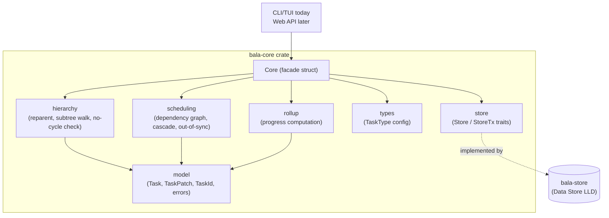

# LLD-1: Bala — Core Library Low-Level Design

**Status:** Proposed
**Date:** 2026-08-31
**Deciders:** Scott (product/eng)
**Related:** [HLD.md](./HLD.md) (Core Library component), [STORIES.md](./STORIES.md) (Epics 1–4)

## Context

HLD.md fixed the Core Library as the single home for task CRUD, hierarchy
invariants, dependency invariants, cascade scheduling, and progress rollup,
exposed as one method contract that the CLI/TUI calls in-process today and
a future Web API wraps unchanged. It deliberately left language, exact
signatures, and algorithms to this LLD. Three decisions from that list
were resolved before writing this doc, since they change the method
surface itself rather than just its implementation:

- **Language: Rust.** A compiled, statically-typed library that both an
  in-process CLI/TUI and a future HTTP layer can call gives the strongest
  compile-time guarantee that invariants (no circular hierarchy, no
  circular dependency, dates always library-computed) can't be bypassed
  by a caller — see the [rust-best-practices](../../.claude/skills/rust-best-practices)
  guidance applied throughout §4–§6 below.
- **Delete: soft-delete.** `delete_task` sets a `deletedAt` tombstone
  rather than physically removing rows. Tombstoned tasks are excluded
  from normal queries but stay in the graph for a recovery window, so
  hierarchy/dependency invariants never have to reason about a task that
  half-exists.
- **Completion: block-by-default, cascade-on-request** — the `rm` /
  `rm -r` model. `complete_task` rejects completing a parent with
  incomplete children unless the caller explicitly asks for the
  cascading form, which completes the whole subtree. No silent
  auto-complete and no silent "just ignore the children" — the caller
  always gets one of the two explicit behaviors.

This LLD covers the `bala-core` crate: its module layout, data types,
error taxonomy, method contract, and the three algorithms (hierarchy
invariant enforcement, dependency cycle detection, cascade scheduling)
that carry the real complexity per HLD's consequences section.

## Decision

`bala-core` is a single crate with internal module seams matching HLD's
call-out (`hierarchy`, `scheduling`, `rollup` are modules, not crates),
plus a `store` module holding the persistence trait boundary and a
`model` module holding shared types. A `Core` struct is the facade every
caller (CLI today, Web API later) drives.



`Core` is generic over its store — `Core<S: Store>` — rather than boxing
internally: there is exactly one store implementation live at a time (the
embedded engine the Data Store LLD picks), so static dispatch costs
nothing and keeps every call monomorphized. A caller that genuinely needs
a trait object (unlikely — the CLI and the future Web API each construct
one concrete `Core<SqliteStore>` at startup) can still box `Core` itself;
that's a boundary decision, not something `bala-core` should pay for
internally.

## Data Model

```rust
/// Opaque, non-`Copy`-sized but small newtype wrapper — one per domain
/// entity — so a `TaskId` can never be passed where a `UserId` is
/// expected, even though both wrap a `Uuid`.
pub struct TaskId(Uuid);
pub struct UserId(Uuid);

pub struct Task {
    pub id: TaskId,
    pub title: String,
    pub description: Option<String>,
    pub parent_id: Option<TaskId>,
    pub type_key: String,           // FK into TaskType.key; "task" default
    pub status: TaskStatus,
    pub start_date: Option<NaiveDate>,
    pub due_date: Option<NaiveDate>,
    pub assignee_id: Option<UserId>,
    pub depends_on: Vec<TaskId>,    // predecessors, finish-to-start
    pub out_of_sync: bool,
    pub progress: f32,              // 0.0..=1.0, library-computed, read-only
    pub created_at: DateTime<Utc>,
    pub updated_at: DateTime<Utc>,
    pub completed_at: Option<DateTime<Utc>>,
    pub deleted_at: Option<DateTime<Utc>>,  // soft-delete tombstone
}

pub enum TaskStatus { Incomplete, Complete }

pub struct TaskType {
    pub key: String,       // stable identifier, e.g. "initiative"
    pub label: String,     // display name, user-renameable
    pub color: Option<String>,
    pub sort_order: i32,
}
```

**`TaskPatch` — the "don't touch" vs. "clear" problem.** A plain
`Option<T>` field on a patch struct is ambiguous: does `None` mean "leave
it alone" or "set it to nothing"? Rather than lean on `Option<Option<T>>`
(compiles, but reads badly at every call site — `Some(None)` is not
self-documenting), `TaskPatch` uses a small explicit enum per nullable
field:

```rust
pub enum Field<T> {
    Keep,
    Set(T),
    Clear,   // only meaningful for Option<T> targets, e.g. description
}

pub struct TaskPatch {
    pub title: Field<String>,
    pub description: Field<String>,   // Clear -> None
    pub start_date: Field<NaiveDate>, // Clear -> None
    pub due_date: Field<NaiveDate>,   // Clear -> None
    pub assignee_id: Field<UserId>,   // Clear -> unassign
    pub type_key: Field<String>,
    // parent_id and depends_on are intentionally NOT here — reparenting
    // and dependency edits go through their own dedicated methods
    // (reparent_task, add/remove_dependency) because each carries its
    // own invariant check that a generic patch would obscure.
}

impl Default for TaskPatch {
    fn default() -> Self { /* every field Field::Keep */ }
}
```

Callers build a patch with struct-update syntax against
`TaskPatch::default()`, touching only what changed — e.g.
`TaskPatch { title: Field::Set("New title".into()), ..Default::default() }`.

## Error Taxonomy

One `thiserror`-derived enum, `CoreError`, per the "structured errors any
caller can render consistently" contract in HLD §Interfaces. No
`anyhow`/string errors cross this boundary — `bala-core` is a library, not
a binary.

```rust
#[derive(Debug, thiserror::Error)]
pub enum CoreError {
    #[error("task {0:?} not found")]
    NotFound(TaskId),

    #[error("title must not be empty")]
    EmptyTitle,

    #[error("due date {due} is before start date {start}")]
    InvalidDateRange { start: NaiveDate, due: NaiveDate },

    #[error("moving {task:?} under {attempted_parent:?} would make it its own ancestor")]
    CircularHierarchy { task: TaskId, attempted_parent: TaskId },

    #[error("{task:?} cannot depend on {other:?}: it is an ancestor/descendant of it")]
    DependsOnRelative { task: TaskId, other: TaskId },

    #[error("adding this dependency would create a cycle: {cycle:?}")]
    CircularDependency { cycle: Vec<TaskId> },

    #[error("{task:?} has incomplete children: {incomplete:?}; pass cascade=true or complete them first")]
    IncompleteChildren { task: TaskId, incomplete: Vec<TaskId> },

    #[error("unknown task type {0:?}")]
    UnknownTaskType(String),

    #[error(transparent)]
    Store(#[from] StoreError),
}
```

Every variant carries the ids/values needed to render a specific message
without re-querying — matching HLD's "touched tasks" philosophy applied
to errors, not just successes.

## Method Contract (the `Core` facade)

```rust
impl<S: Store> Core<S> {
    pub fn create_task(&mut self, new: NewTask) -> Result<Task, CoreError>;
    pub fn update_task(&mut self, id: TaskId, patch: TaskPatch) -> Result<Vec<Task>, CoreError>;
    pub fn delete_task(&mut self, id: TaskId, mode: DeleteMode) -> Result<Vec<Task>, CoreError>;
    pub fn restore_task(&mut self, id: TaskId) -> Result<Task, CoreError>;
    pub fn reparent_task(&mut self, id: TaskId, new_parent: Option<TaskId>) -> Result<Task, CoreError>;
    pub fn add_dependency(&mut self, id: TaskId, predecessor: TaskId) -> Result<Task, CoreError>;
    pub fn remove_dependency(&mut self, id: TaskId, predecessor: TaskId) -> Result<Task, CoreError>;
    pub fn complete_task(&mut self, id: TaskId, cascade: bool) -> Result<Vec<Task>, CoreError>;
    pub fn preview_cascade(&self, id: TaskId, patch: TaskPatch) -> Result<Vec<Task>, CoreError>;
    pub fn get_tree(&self, filter: TreeFilter) -> Result<Vec<Task>, CoreError>;
    pub fn list_task_types(&self) -> Result<Vec<TaskType>, CoreError>;
    pub fn upsert_task_type(&mut self, t: TaskType) -> Result<TaskType, CoreError>;
}

pub enum DeleteMode { Subtree, PromoteChildren }
```

`DeleteMode` and `complete_task`'s `cascade: bool` are the two places this
contract encodes the "rm vs. rm -r" decision from §Context — deliberately
as an explicit parameter rather than two method names, since the CLI/Web
API each map it onto one confirmation prompt either way.

## Algorithms

### 1. Hierarchy invariant — no circular nesting (Stories 2.1 AC5)

`reparent_task(id, new_parent)`: walk `new_parent`'s ancestor chain via
`parent_id` up to the root. If `id` appears in that chain, reject with
`CircularHierarchy`. O(depth) — no full-tree walk needed. `create_task`
runs the same check when `NewTask.parent_id` is set (an id can't be its
own ancestor at creation, but the check is shared code, not special-cased
away).

### 2. Dependency invariants (Story 3.1 AC2–3)

`add_dependency(id, predecessor)`:
1. Reject if `id == predecessor` (self-dependency).
2. Walk `id`'s ancestor chain and descendant subtree (hierarchy graph);
   reject with `DependsOnRelative` if `predecessor` appears in either —
   this is the one place a dependency check must cross into the
   hierarchy graph, per HLD §4.
3. Cycle check on the dependency graph itself: before adding the edge
   `predecessor → id`, DFS from `id` following existing `depends_on`
   edges outward (i.e., walk what `id` already (transitively) depends
   on). If `predecessor` is reachable, the new edge would close a cycle
   — reject with `CircularDependency { cycle }`, where `cycle` is the
   path found. This is a plain reachability check, not a full
   topological sort, and runs in O(edges) per call.

`remove_dependency` has no invariant to check — removing an edge can
never introduce a cycle or a relative-dependency violation.

### 3. Cascade scheduling (Story 3.2 AC1–4)

Two distinct triggers, kept separate because they have different
observable outcomes:

- **A task's own dates are edited directly** (`update_task` on a task
  that itself has predecessors): if the new `start_date` would fall
  before the latest `due_date` among its predecessors, the edit is
  **allowed but flags `out_of_sync = true`** on that task (AC4 — manual
  override, not an auto-correction).
- **A predecessor's `due_date` changes, forward propagation to
  successors** (AC1–2): for every successor whose constraint is now
  violated, its dates shift forward by the same delta (duration
  preserved), and that shift is *not* flagged out-of-sync — it's the
  system doing its job, not an override.

Cascade algorithm (used by both `update_task`'s forward-propagation step
and `preview_cascade`):

```
fn cascade(changed: TaskId, new_due: NaiveDate, graph) -> Vec<Task> {
    let mut touched = HashMap::new();       // TaskId -> Task, dedup + latest value
    let mut queue = VecDeque::from([changed]);
    while let Some(current) = queue.pop_front() {
        let due = touched.get(&current).map(|t| t.due_date).unwrap_or(new_due);
        for successor in graph.successors_of(current) {  // tasks that depend on `current`
            if successor.start_date < due {
                let delta = due - successor.start_date;
                let shifted = successor.shift_by(delta);  // preserves duration
                touched.insert(successor.id, shifted);
                queue.push_back(successor.id);            // re-examine its own successors
            }
        }
    }
    touched.into_values().collect()
}
```

Because the dependency graph is acyclic by construction (§2 rejects
cycles at edge-add time), this queue drains in finite steps — a task can
be re-pushed if a later relaxation shifts it further out (multiple
incoming edges), but each push strictly increases its `start_date`, so
the loop terminates. `preview_cascade` runs this against an in-memory
copy of the affected subgraph and returns the result **without** calling
`Store::put_task` — same computation, no commit, satisfying Story 3.2
AC3's "preview before committing".

`update_task` calls `cascade` when `due_date` moves later, then persists
`[changed_task] + touched` inside one `Store::transaction`, and returns
the full `Vec<Task>` so a caller can refresh every affected view without
re-querying (HLD §Interfaces guarantee).

### 4. Progress rollup (Story 2.3 AC1–5)

Computed on read inside `get_tree`, never stored, never computed by a
caller (HLD guarantee). Single post-order traversal per call:

```
fn rollup(task, children) -> f32 {
    if children.is_empty() {
        return match task.status { Complete => 1.0, Incomplete => 0.0 };  // AC5
    }
    children.iter().map(|c| c.progress).sum::<f32>() / children.len() as f32
}
```

A task's own `status` is independent of its rollup number once it has
children (AC4) — `progress` and `status` are reported as two separate
fields on `Task`, never conflated. O(n) for the whole tree per
`get_tree` call, not O(n) per task.

### 5. `complete_task` (Story 1.4 AC2, resolved per §Context)

```
fn complete_task(id, cascade) -> Result<Vec<Task>, CoreError> {
    let incomplete_children = direct_incomplete_children(id);
    if !incomplete_children.is_empty() && !cascade {
        return Err(CoreError::IncompleteChildren { task: id, incomplete: incomplete_children });
    }
    // cascade == true: complete the whole subtree; cascade == false with
    // no incomplete children: complete just this task.
    mark_complete(id, recursive: cascade)
}
```

Returns every task actually completed (one, or the whole touched
subtree) — again so a caller refreshes views from the return value
rather than re-querying.

## Storage Boundary

Not a network contract (HLD §4) — a Rust trait so `bala-core` is
testable against an in-memory fake today and the Data Store LLD's
embedded engine is just another implementation. Per HLD, hierarchy
(`parent_id`) and dependency edges are related-but-independent graphs
stored distinctly, so the trait doesn't fold edges into the task row:

```rust
pub trait Store {
    fn transaction<T>(
        &self,
        f: impl FnOnce(&mut dyn StoreTx) -> Result<T, StoreError>,
    ) -> Result<T, StoreError>;
}

pub trait StoreTx {
    fn get_task(&mut self, id: TaskId) -> Result<Option<Task>, StoreError>;
    fn put_task(&mut self, task: &Task) -> Result<(), StoreError>;
    fn list_tasks(&mut self, filter: &TreeFilter) -> Result<Vec<Task>, StoreError>;

    fn list_dependency_edges(&mut self, id: TaskId) -> Result<Vec<TaskId>, StoreError>;
    fn add_dependency_edge(&mut self, predecessor: TaskId, successor: TaskId) -> Result<(), StoreError>;
    fn remove_dependency_edge(&mut self, predecessor: TaskId, successor: TaskId) -> Result<(), StoreError>;

    fn get_task_types(&mut self) -> Result<Vec<TaskType>, StoreError>;
    fn put_task_type(&mut self, t: &TaskType) -> Result<(), StoreError>;
}
```

Every `Core` method that touches more than one task (cascade, subtree
delete/complete) wraps its writes in one `Store::transaction` call, so a
cascade either commits as a whole or not at all — the Data Store LLD's
job is to make `transaction` atomic for whatever engine it picks, not to
redesign this boundary.

**Not addressed here (matches HLD's open item):** multiple concurrent
writers. `Core` assumes single-writer-at-a-time, consistent with a local
embedded store; multi-client concurrent editing is still an open question
flagged at the HLD level, not solved by adding locking here.

## Testing Strategy

- `hierarchy`, `scheduling`, and `rollup` are unit-tested against an
  in-memory fake `Store` — no I/O, fast, and exercises exactly the
  algorithms in §Algorithms.
- Name tests for behavior, not method name, per rust-best-practices:
  e.g. `add_dependency_should_reject_cycle_through_transitive_predecessor`,
  `complete_task_should_block_when_children_incomplete_and_cascade_false`.
- Property-style tests for cascade: random small DAGs, assert the
  post-cascade graph satisfies "every successor's start ≥ every
  predecessor's due" and that `preview_cascade` and `update_task` agree
  on the touched set before the latter commits.

## Deferred to Other LLDs

- **Data Store LLD:** which embedded engine implements `Store`/`StoreTx`,
  schema, indexing for tree + dependency queries at 200+ tasks.
- **CLI/TUI Client LLD:** how `preview_cascade`'s result is rendered as a
  confirmation prompt (Story 3.2 AC3) and how `IncompleteChildren`/
  `CircularHierarchy`/etc. map to on-screen messages.
- **Web API LLD:** near-mechanical mapping of this method contract onto
  routes; `CoreError` variants map onto HTTP status + JSON error body.

## Consequences

- The three method-shape decisions from §Context (soft-delete,
  block-then-cascade completion, `Field<T>` patches) are now load-bearing
  on the public API — changing any later is a breaking change to every
  caller, including the future Web API.
- `Core<S: Store>` being generic rather than trait-object-based means one
  monomorphized build per concrete store; fine today (one store type),
  worth revisiting only if a second concrete `Store` impl (e.g. a test
  double shipped in the same binary as production) ever needs to coexist
  at runtime rather than at compile time.
- `preview_cascade` and the committing path in `update_task` share the
  same `cascade()` function by construction — there's no way for preview
  to drift from what actually commits, which is the whole point of
  Story 3.2 AC3.

## Action Items
1. [ ] Scaffold `bala-core` crate with the module layout in §Decision
2. [ ] Implement `model`, `CoreError`, `Field<T>`/`TaskPatch` (no logic yet)
3. [ ] Implement `hierarchy` module + tests (§Algorithm 1)
4. [ ] Implement `scheduling` module + tests (§Algorithms 2–3), including `preview_cascade`
5. [ ] Implement `rollup` module + tests (§Algorithm 4)
6. [ ] Implement `complete_task` + `delete_task`/`restore_task` (§Algorithm 5, soft-delete)
7. [ ] Define in-memory fake `Store` for tests; hand the `Store`/`StoreTx` traits to the Data Store LLD
