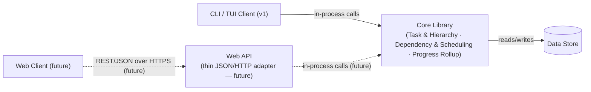

# HLD-1: Bala — High-Level Design

**Status:** Proposed
**Date:** 2026-08-30
**Deciders:** Scott (product/eng)
**Related:** [STORIES.md](./STORIES.md) (Epics 1–5)

## Context

Bala is a new task management app: arbitrarily-nested tasks (which may
have more than one parent), typed dependencies (finish-to-start as the
baseline case, per STORIES.md) with cascading reschedule, and a Gantt
view derived from task data. Per STORIES.md it starts single-user /
small-team with no existing design files.

This HLD stays intentionally coarse: it fixes the component boundaries and
the contracts between them so that each component can get its own LLD
later without those documents fighting over where a responsibility lives.
It does not pick a language, framework, or database engine — those are LLD
decisions.

## Decision

**v1 client is a CLI → TUI, with a web client planned for later.** Rather
than build one client-shaped API and retrofit a second client onto it,
the domain logic is split out as its own component — a **Core Library**
— from day one. The CLI/TUI links against it directly (in-process,
no server to run for a single local user). When the web client arrives,
a thin **Web API** component wraps the same library over HTTP/JSON; it
adds no logic of its own, so there's no "extract the business logic out
of the CLI binary" step later — the right methods already live in a
library, not tangled into `main()`.



### Component responsibilities

| Component | Owns | Does NOT own |
|---|---|---|
| **CLI/TUI Client (v1)** | Terminal rendering (tree/list, task detail, text-based Gantt), keyboard-driven interaction including rescheduling, client-local view state (collapse/expand, zoom — a local config file, not a server-side setting) | Any business rule; calls the Core Library and trusts its answers |
| **Web Client (future)** | Browser rendering equivalent, mouse drag-to-reschedule, PNG/PDF export | Same — no business logic; talks only to the Web API, never the library directly |
| **Core Library** | The entire domain layer: task CRUD, hierarchy invariants (no circular nesting, multi-parent reparenting), dependency invariants (no self/ancestor deps, cycle detection, typed constraints), typed cascade scheduling (finish-to-start default, plus start-to-start/finish-to-finish/start-to-finish), progress rollup, task-type/label config. Every rule lives here exactly once, exposed as a set of methods any caller — in-process today, wrapped over HTTP later — uses the same way | Rendering, transport, serialization, HTTP concerns |
| **Web API (future)** | Pure translation: HTTP routing + JSON (de)serialization + (eventually) auth — ideally ~one endpoint per Core Library method | Any domain logic. If a rule can't be phrased as "call this library method," it doesn't belong in this layer |
| **Data Store** | Durable persistence of tasks, hierarchy edges (a task may have multiple parents), dependency edges, task types, and their timestamps, and minimal user identity rows (`id`, `name`) for task assignment | Any business rules — invariants are enforced by the Core Library before writes |

This still groups Epics 1, 3, and 4's logic (CRUD, hierarchy, dependencies,
rollup) into one component rather than three — splitting those at this
scale would add call/transaction boundaries between tightly-coupled
invariants (e.g., deleting a task touches hierarchy *and* dependency
state together). The Core Library LLD can still internally module-ize
these as `hierarchy`, `scheduling`, `rollup` — that's an internal seam,
not a component boundary.

## Interfaces / Contracts

The shared resource shape is the same regardless of which contract
carries it (fields grow in LLD, not here):

```
Task {
  id, title, description,
  parentIds: [taskId],      // empty = top-level; a task may sit under
                             // more than one parent (e.g. shared by two
                             // goals/projects) — hierarchy is a DAG, not
                             // a strict tree
  type,                     // Initiative | Goal | Project | Story | Task | custom
  status,                   // incomplete | complete (extensible later)
  startDate, dueDate,
  assigneeId,               // resolves to a real User (minimal id+name,
                             // no auth) — not a bare/unvalidated field
  dependsOn: [{predecessorId, type}], // type = finish-to-start (default),
                                       // start-to-start, finish-to-finish,
                                       // or start-to-finish
  outOfSync: boolean,       // true if manually overridden past a dependency constraint
  progress,                 // rollup %, library-computed, read-only
  createdAt, updatedAt, completedAt
}
```

### 1. CLI/TUI Client ↔ Core Library — in-process method contract

This is the primary contract to get right, since it's called directly
today and wrapped unchanged tomorrow. Method groups (illustrative —
exact signatures/error types are a Core Library LLD concern):

```
create_task(NewTask)                          -> Task
update_task(id, TaskPatch)                     -> Task
delete_task(id, mode: Subtree | PromoteChildren) -> Vec<Task>   // touched
set_parents(id, newParentIds)                  -> Task
add_dependency(id, predecessorId, type)        -> Task
remove_dependency(id, predecessorId)           -> Task
preview_cascade(id, TaskPatch)                 -> Vec<Task>     // Story 4.2 AC3, no commit
get_tree(filter)                               -> Vec<Task>     // progress pre-computed
list_task_types() / upsert_task_type(...)
```

Errors are structured (e.g. `CircularHierarchy`, `CircularDependency`,
`InvalidDateRange`) so any caller — CLI today, Web API later — can render
them consistently rather than parsing strings.

**Contract behaviors the library guarantees** (so no caller reimplements
them): rejects circular nesting and circular/invalid dependencies;
cascades a predecessor's date change through successors and returns
*every* task it touched from one call, so a caller can refresh every
affected view without re-querying; `progress` is always library-computed
on read, never derived by a caller, so list/tree/Gantt can't drift apart.

**Client-only state:** collapse/expand state and Gantt scale/zoom are
per-user view preferences with no cross-device requirement yet — not
passed through the library at all. For the CLI/TUI that's a local config
file; a future Web Client would use browser storage. Promote to a
library-backed preference if multi-device sync is ever needed — called
out so an LLD doesn't build that prematurely.

**Not resolved by this HLD (CLI/TUI-specific, defer to that Client's
LLD):**
- Rescheduling from the Gantt chart is now split into two client-specific
  stories rather than one drag-oriented story: Story 5.3 (TUI, keyboard —
  select a bar, nudge dates with keys/numeric input, same as an editor
  "insert mode") targets v1 and Story 5.4 (Web/GUI, mouse drag) targets
  the future Web Client. Both call the same `update_task`/`preview_cascade`
  methods — only the input mechanism differs, so no new library surface
  is needed for either.
- Story 5.5 (PNG/PDF export) has no natural terminal output. Options:
  a text/ASCII export for v1, or defer true image export until the Web
  Client exists (canvas rendering is a natural fit there). Not decided
  here — flagged as an open question for the CLI/TUI Client LLD.

### 2. Web API ↔ Core Library — future, in-process

A near-mechanical translation of the method contract above onto HTTP
verbs/routes plus JSON (de)serialization and (eventually) auth — it
should introduce no new behavior. If designing an endpoint requires new
domain logic, that logic belongs in the Core Library, not here; this
constraint is what keeps "add a web client" an additive change rather
than a refactor.

### 3. Web Client (future) ↔ Web API — REST/JSON over HTTPS

Same endpoint groups this HLD originally sketched for a web client
(Task CRUD, hierarchy, dependencies, types — Gantt still composed
client-side from `GET /tasks`, no dedicated Gantt endpoint), now
understood as a pass-through to the Core Library rather than a service
with its own logic.

### 4. Core Library ↔ Data Store — internal

Not a network contract. The one constraint this HLD fixes: tasks form a
hierarchy graph (`parentIds` — a DAG, since a task may have more than one
parent) plus a separate typed dependency edge set (`predecessorId →
successorId`, each edge carrying a finish-to-start/start-to-start/
finish-to-finish/start-to-finish type), stored distinctly — hierarchy and
dependency are related but independent graphs (a dependency validity
check must walk the hierarchy graph too, per Story 4.1 AC2). Given the
CLI/TUI runs locally and in-process, an embedded engine (e.g. SQLite) is
the natural v1 choice, but that's a Data Store LLD decision. Schema,
indexing, and transaction boundaries are also deferred there.

## Deferred to LLDs

- **CLI/TUI Client LLD (v1):** terminal view components, text-based Gantt rendering/zoom/pan, keyboard-driven rescheduling (replacing drag), export mechanism decision (Story 5.5), local config file format for view state.
- **Core Library LLD:** method/error signatures, hierarchy invariant enforcement, dependency cycle detection algorithm, cascade scheduling algorithm (and its "preview before committing" UX per Story 4.2 AC3), progress rollup computation, task-type config storage.
- **Data Store LLD:** engine choice (embedded, e.g. SQLite, given v1 runs locally in-process), schema, indexing strategy for tree + graph queries at 200+ tasks. Soft- vs. hard-delete for Story 1.3 AC5 is resolved (soft-delete, per Core Library LLD §Context) — the Data Store LLD implements the `deletedAt` tombstone, it doesn't re-decide the question.
- **Web Client LLD / Web API LLD:** deferred until that phase starts; the Web API LLD should mostly fall out of the Core Library LLD's method list.

## Consequences

- Domain logic lives in one library from the start, not in the CLI binary — adding the web client later is additive (new Web API + Web Client components) rather than a refactor to pull business logic out of `main()`.
- Fewer moving parts to stand up and run for v1: no server process, no service-to-service auth, no deploy — the CLI links the library and reads/writes a local store directly.
- The Core Library is a single point carrying real domain complexity (hierarchy + dependency + rollup together) — worth its own careful LLD, and its method boundary is now also the future HTTP API's boundary, so it's worth getting the shapes (especially error types and the "touched tasks" return values) right early.
- No real-time sync (WebSocket/SSE) between multiple concurrent users/clients is in this HLD; "immediate" updates (Stories 1.1, 3.2, 3.3) are satisfied by direct calls into the library (v1) or normal request/response + optimistic UI (future web). Multi-client concurrent editing (e.g. CLI and web open on the same task data at once) isn't addressed here — noted so it isn't silently assumed away.

## Action Items
1. [x] Write Core Library LLD (method contract, hierarchy / scheduling / rollup modules)
2. [x] Write Data Store LLD
3. [x] Write CLI/TUI Client LLD
4. [x] Decide soft-delete vs. undo mechanism for Story 1.3 AC5 — resolved: soft-delete, per Core Library LLD §Context
5. [x] Decide v1 export approach for Story 5.5 — resolved: text/ASCII export now, per CLI/TUI Client LLD §Algorithm 4 (PNG/PDF deferred to Web Client)
