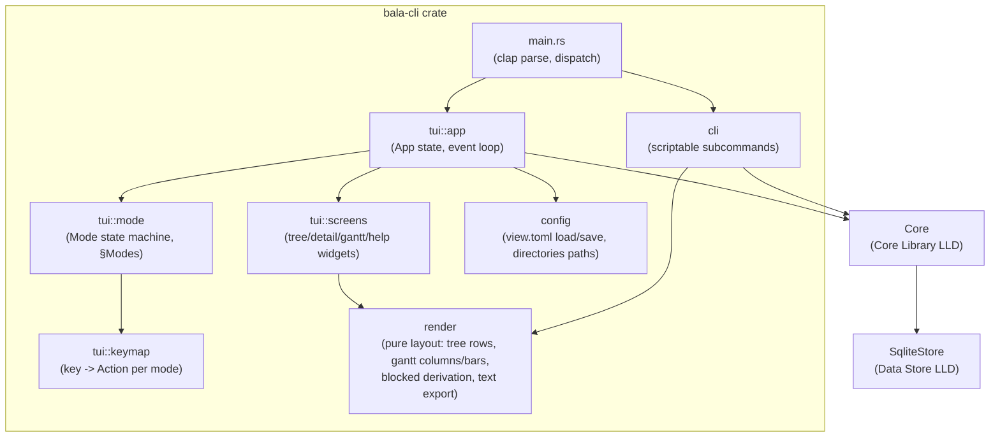

# LLD-3: Bala — CLI/TUI Client Low-Level Design

**Status:** Proposed
**Date:** 2026-09-03
**Deciders:** Scott (product/eng)
**Related:** [HLD.md](./HLD.md) (CLI/TUI Client component), [core-library.md](./core-library.md) (`Core<S: Store>` facade this LLD calls in-process), [data-store.md](./data-store.md) (`SqliteStore::open` path this LLD supplies), [user stories](https://github.com/sleb/bala/issues?q=label%3Astory)

## Context

HLD.md fixed the CLI/TUI Client as terminal rendering, keyboard-driven
interaction, and client-local view state, calling `bala-core` in-process
with no business logic of its own. It deferred five things to this LLD:
terminal view components, text-based Gantt rendering/zoom/pan,
keyboard-driven rescheduling ([#65](https://github.com/sleb/bala/issues/65), replacing drag), the [#67](https://github.com/sleb/bala/issues/67)
export mechanism decision, and the local config file format for view
state. This LLD is also the last piece needed to close HLD's action item
5 (v1 export approach), still open at the top of HLD.md.

Four decisions are resolved here rather than left open, since they shape
the crate/module layout and every screen built on top of it, not just
their implementation:

- **One binary, two modes: TUI + scriptable CLI subcommands.** `bala`
  with no subcommand launches the interactive TUI (the primary v1
  experience, covering every story in Epics 1–5); `bala task add`,
  `bala dep add`, `bala export gantt`, etc. are non-interactive
  subcommands for scripting/automation. Both drive the same
  `Core<SqliteStore>` in the same process — the TUI is not a special
  case the CLI subcommands route through, they're two front ends over
  one facade, matching HLD's "no business logic in the client" rule
  for both.
- **TUI framework: `ratatui` + `crossterm`.** Immediate-mode rendering
  redraws the whole frame from `App` state each tick, which keeps the
  render path a pure function of state — important here because §Screens
  reuses the same layout/rendering functions for the interactive Gantt
  pane and the [#67](https://github.com/sleb/bala/issues/67) text export (render once, either to a terminal
  frame or a string buffer). `crossterm` gives cross-platform raw-mode
  input without pulling in a heavier framework than four screens and a
  handful of widgets need.
- **Keybindings: vim-modal.** A `Mode` enum (§Modes & Keybindings) drives
  input dispatch the way HLD's own "insert mode" analogy for [#65](https://github.com/sleb/bala/issues/65)
  already implied — Normal mode for navigation, dedicated modes for text
  entry, rescheduling, and destructive-action confirmation, `Esc` always
  cancels back to Normal. One consistent modal grammar reused across
  every editing interaction rather than a bespoke keymap per screen.
- **View state: TOML file in the OS config dir, separate from the SQLite
  data file.** The `directories` crate resolves both paths
  (`ProjectDirs::from("", "", "bala")`) — config dir for `view.toml`
  (this LLD), data dir for `bala.db` (Data Store LLD's `SqliteStore::open`
  path, previously unresolved there — see §Deferred to Other LLDs).
  Human-editable TOML for the same reason Data Store LLD picked
  human-readable ISO-8601 text over epoch integers: a local single-user
  app someone may reasonably want to inspect or hand-edit.

This LLD covers the `bala-cli` crate: module layout, the mode state
machine, the four screens (tree/list, task detail, Gantt, help), the
Gantt rendering and reschedule algorithms, the scriptable subcommand set,
config format, and error-to-message mapping.

## Decision

`bala-cli` is a single binary crate. `main.rs` parses argv with `clap`;
if a subcommand is present it dispatches to `cli` and exits, otherwise it
opens the TUI (`tui::run`). Both paths construct one `Core<SqliteStore>`
at startup and share the `render` module, which holds every pure
layout/formatting function — the only code that turns `Task`s into text —
so the interactive Gantt pane and the `export gantt` subcommand can never
draw two different pictures of the same schedule.



`render` takes `&[Task]` (already fetched via `get_tree`) plus a
`ViewState` and returns plain data — rows of styled text spans, a grid of
gantt cells — never a `ratatui::Frame` directly. `tui::screens` adapts
that data into `ratatui` widgets; `cli`'s `export gantt` subcommand
formats the same data as plain UTF-8 box-drawing text to a file. Neither
consumer duplicates layout logic, mirroring how Core LLD's
`preview_cascade` and `update_task` share one `cascade()` function.

## View State & Config

```rust
pub struct ViewState {
    pub collapsed: HashSet<TaskId>,      // #38 AC2: persists across sessions
    pub selected: Option<TaskId>,        // last-focused task, restored on relaunch
    pub gantt_scale: GanttScale,         // #64 AC5: persists across sessions
    pub gantt_anchor: NaiveDate,         // left edge of the last viewport (pan position)
    pub filter: TreeFilter,              // Core LLD's TreeFilter, reused verbatim —
                                          // #40 AC4 / #62 AC4 filter/group state
    pub blocked_only: bool,              // #62 AC4, not expressible via TreeFilter
}

pub enum GanttScale { Day, Week, Month }
```

**Implemented so far:** `selected`, `collapsed`, and the type filter. The
type filter is stored as `filter_type_key` in the `[tree]` table rather
than the `[filter]` table sketched below. `gantt_scale`, `gantt_anchor`,
and `blocked_only` are added with the Gantt view and the blocked-task
filter. Saving currently happens on the normal quit path only: the
`Ctrl-C`/`SIGTERM` cleanup guard described below is the intended design
but isn't built yet. Until it is, the temp-then-rename write is what
keeps a crash or kill from corrupting the file.

Serialized as TOML at `<config_dir>/bala/view.toml`:

```toml
[tree]
collapsed = ["b3f1...", "9ac2..."]   # TaskId as hyphenated UUID string
selected = "b3f1..."

[gantt]
scale = "week"
anchor_date = "2026-09-01"

[filter]
type_key = "goal"
blocked_only = false

[data]
db_path = "/Users/scott/.local/share/bala/bala.db"  # resolved default, override-able
```

`config::load()` reads this at startup (missing file → `ViewState::default()`,
not an error — first run). `config::save()` writes on quit (`q` in
Normal mode) and on `Ctrl-C`/`SIGTERM` via a cleanup guard (not yet
implemented; see the status note above), using a
write-to-temp-then-rename so a crash mid-write can't corrupt the file —
the same atomicity concern Data Store LLD solved with SQL transactions,
solved here with the filesystem's rename semantics since there's no
database involved. `db_path` resolves via `directories::ProjectDirs`
data dir by default; this is also what closes Data Store LLD's
`SqliteStore::open` deferred item — this crate is the one that picks the
path and calls `open`.

## Modes & Keybindings

```rust
pub enum Mode {
    Normal,
    Insert { field: EditableField, buffer: String },   // title/description/date text entry
    Reschedule { task: TaskId, edge: Edge, preview: Vec<Task> }, // #65
    Confirm { prompt: String, action: PendingAction },  // delete/complete cascades
    Filter,                                             // #40 AC4 / #62 AC4
    Help,                                                // '?' overlay, current mode's keys
}

pub enum Edge { Both, Start, Due }   // which date(s) a reschedule nudge moves
```

`Mode` lives on `App` and gates key dispatch: `tui::keymap` maps a
`KeyEvent` to an `Action` _given the current mode_, so the same physical
key means different things in different modes without a giant flat
`match` (e.g. `h`/`l` pan the tree cursor in `Normal`, nudge dates in
`Reschedule`, move the text cursor in `Insert`). `Esc` is universal:
every non-`Normal` mode maps it to "discard and return to `Normal`" — for
`Reschedule` that means the `preview` field's uncommitted cascade is
simply dropped, never persisted (§Algorithm 3).

**Normal mode** (default; tree pane always visible on the left, per
[#63](https://github.com/sleb/bala/issues/63) AC2's "tree on the left" — the right pane toggles between Detail and
Gantt):

| Key                  | Action                                                                                                                                            |
| -------------------- | ------------------------------------------------------------------------------------------------------------------------------------------------- |
| `j`/`k`, `↓`/`↑`     | move selection in the flattened visible tree                                                                                                      |
| `h`/`l`, `←`/`→`     | collapse/expand focused task ([#38](https://github.com/sleb/bala/issues/38) AC1)                                                                                                      |
| `gg` / `G`           | jump to first/last visible task                                                                                                                   |
| `E` / `C`            | expand all / collapse all ([#38](https://github.com/sleb/bala/issues/38) AC3)                                                                                                         |
| `J` / `K`            | move focused task down/up among siblings via `Core::move_sibling` under the row's rendered parent (`TaskRow.parent_id`); selection follows the task ([#45](https://github.com/sleb/bala/issues/45)). Swaps use the full sibling order, so with a type filter a press may look like a no-op when the neighbor is hidden (known caveat) |
| `L` / `H`            | indent / outdent the focused task via `Core::indent_task` / `Core::outdent_task` using the row's rendered path (`parent_id`, `grandparent_id`); indent expands the new parent (previous live sibling, from `SiblingOrder`) and selection follows the task to its new row; no-op is silent, errors (e.g. `CircularHierarchy`) show inline ([#45](https://github.com/sleb/bala/issues/45)) |
| `o` / `O`            | new subtask under focused task / new top-level task → `Insert{title}` ([#6](https://github.com/sleb/bala/issues/6), [#37](https://github.com/sleb/bala/issues/37))                                                          |
| `Enter`              | open Detail pane on focused task                                                                                                                  |
| `i` (in Detail pane) | edit a field → `Insert` ([#11](https://github.com/sleb/bala/issues/11))                                                                                                               |
| `dd`                 | delete focused task → `Confirm` ([#12](https://github.com/sleb/bala/issues/12)): `PendingAction::Delete` (`y`/`n`) if `Core::list_children` is empty, else `PendingAction::DeleteWithChildren` naming the child count (`s` = `DeleteMode::Subtree`, `p` = `DeleteMode::PromoteChildren`, `n`/`Esc` cancels); a `list_children` error shows inline and stays in `Normal` |
| `x` / `Space`        | toggle complete → `Confirm` only if blocked by incomplete children ([#13](https://github.com/sleb/bala/issues/13))                                                                    |
| `m`                  | reparent (`set_parents`) → `Insert{parent list}` ([#37](https://github.com/sleb/bala/issues/37) AC4)                                                                                  |
| `p` / `P`            | add / remove dependency → `Insert{predecessor}` ([#60](https://github.com/sleb/bala/issues/60))                                                                                       |
| `t`                  | set task type → `Insert{type}` ([#40](https://github.com/sleb/bala/issues/40))                                                                                                        |
| `g` (Gantt toggle)   | switch right pane Detail ↔ Gantt ([#63](https://github.com/sleb/bala/issues/63))                                                                                                      |
| `r`                  | enter `Reschedule` for focused task; switches right pane to Gantt if it isn't already showing, so the bar being nudged is visible ([#65](https://github.com/sleb/bala/issues/65) AC1) |
| `+`/`-`              | zoom gantt scale in/out — Day↔Week↔Month ([#64](https://github.com/sleb/bala/issues/64) AC1)                                                                                          |
| `T`                  | jump-to-today: recenters `gantt_anchor` ([#64](https://github.com/sleb/bala/issues/64) AC3)                                                                                           |
| `f`                  | open filter menu → `Filter` (type/status/blocked-only)                                                                                            |
| `?`                  | help overlay → `Help`                                                                                                                             |
| `q`                  | save config, quit                                                                                                                                 |

**Reschedule mode** ([#65](https://github.com/sleb/bala/issues/65) AC1–3):

| Key                           | Action                                                                           |
| ----------------------------- | -------------------------------------------------------------------------------- |
| `h`/`l`                       | nudge both dates back/forward by one `gantt_scale` unit (duration preserved)     |
| `Tab`                         | switch `edge` between `Both`/`Start`/`Due`                                       |
| `H`/`L` (with `edge != Both`) | resize the selected edge independently                                           |
| `:`                           | numeric/date entry → `Insert{date}` for a larger jump, then back to `Reschedule` |
| `Enter`                       | commit — calls `update_task` with the accumulated date change                    |
| `Esc`                         | discard preview, return to `Normal`                                              |

**Confirm mode** presents the prompt text (§Error Rendering for
`CoreError`-derived prompts) and, for most `PendingAction`s, accepts `y`/`n`
only; `y` runs the `PendingAction` (`delete_task` for a task with no
children, or `complete_task` with `cascade: true`), `n`/`Esc` cancels. The
childless delete passes `DeleteMode::PromoteChildren`: identical to
`Subtree` for a leaf, but if another process gave the task children after
the prompt opened, they are promoted rather than silently deleted.
`PendingAction::DeleteWithChildren` (`dd` on a task that has live children,
counted via `Core::list_children` so children hidden by the type filter
still count) instead accepts `s` (`delete_task` with
`DeleteMode::Subtree`), `p` (`delete_task` with `DeleteMode::PromoteChildren`,
reparenting the children to the deleted task's parents or to top level), or
`n`/`Esc`; `y` is unbound there, mirroring the CLI's refusal to delete a
parent without `--cascade` or `--promote-children`. After either delete the
list is re-rendered from a fresh `get_tree`.

## Screens

### Tree/List View (left pane, always visible in Normal/Reschedule)

Flattens the visible subset of `get_tree`'s result — a task is visible
if every ancestor on at least one of its paths to a root is expanded
([#38](https://github.com/sleb/bala/issues/38)) — into ordered rows, each showing: expand/collapse glyph,
indentation by depth, type label/color tag ([#40](https://github.com/sleb/bala/issues/40) AC3), title,
progress fraction ([#39](https://github.com/sleb/bala/issues/39) AC1, `"3/7"` style per [#38](https://github.com/sleb/bala/issues/38) AC4's
collapsed-summary requirement — shown on every row, not just collapsed
ones, since it's cheap once computed), a completion glyph, and a blocked
indicator ([#62](https://github.com/sleb/bala/issues/62) AC1, §Algorithm 2). A task shared by two parents
(HLD's DAG hierarchy) appears once per parent it's expanded under — the
tree view is a rendering of paths through the DAG, not a claim that the
task itself is duplicated; selecting either instance operates on the
same underlying `TaskId`.

### Task Detail View (right pane)

All fields from HLD's shared `Task` shape, plus the two lists [#60](https://github.com/sleb/bala/issues/60)
AC5 requires: "blocked by" (this task's `depends_on`, each with its
predecessor's title/status) and "blocks" (successor lookup — the CLI has
no direct `list_successors` call on `Core`; it derives this by scanning
the already-fetched tree's `depends_on` lists for entries naming this
task, which is O(tasks) but runs once per render against data already in
memory, not a new query). `i` on a field enters `Insert` scoped to that
field.

### Gantt View (right pane, toggled with `g`)

Same tree rows on the left (shared component — a task's row index is
identical in both panes so bars line up with their titles), a date-axis
timeline on the right. §Algorithm 1 covers column mapping and bar
drawing; §Algorithm 3 covers the reschedule overlay.

### Help Overlay

A static per-`Mode` rendering of the table in §Modes & Keybindings —
generated from the same `Keymap` data the dispatcher uses, not a
hand-maintained second copy, so it can't drift out of sync with what the
keys actually do.

## Algorithms

### 1. Gantt rendering: scale mapping, bars, collapsed summaries ([#63](https://github.com/sleb/bala/issues/63), [#64](https://github.com/sleb/bala/issues/64))

`GanttScale` fixes a column width in days: `Day` → 1, `Week` → 7,
`Month` → 30 (calendar-approximate; exact month boundaries aren't needed
for a text chart's column ticks). Given the pane's terminal width in
columns and `gantt_anchor` (leftmost visible date), column `c`'s date
range is `[anchor + c*unit, anchor + (c+1)*unit)`. `date_to_column(d)`
and `column_to_date_range(c)` are the two inverse functions everything
else uses — pan (`gantt_anchor` shift) and zoom (`gantt_scale` swap) only
ever change their inputs, never the drawing code that calls them.

For each visible row (same visibility rule as the tree pane), draw a bar
from `date_to_column(task.start_date)` to `date_to_column(task.due_date)`
using `═`; unscheduled tasks ([#63](https://github.com/sleb/bala/issues/63) AC3: missing either date) are
excluded from the bar area and listed in a fixed "Unscheduled" section
below the chart instead of occupying a row with no bar. Bar styling
encodes status: complete (dim/checked), blocked (§Algorithm 2, distinct
color per [#62](https://github.com/sleb/bala/issues/62) AC5), out-of-sync (Core LLD's `out_of_sync` flag,
distinct glyph at the bar's edge), normal. The `today` column is always
highlighted regardless of scroll position, per [#64](https://github.com/sleb/bala/issues/64) AC2.

**Collapsed parent → single summary bar ([#64](https://github.com/sleb/bala/issues/64) AC4):** when a parent
is collapsed, its row's bar spans `min(start_date)`..`max(due_date)`
across every descendant in its (currently hidden) subtree — computed
once per render via the same post-order walk `render` already does for
progress-rollup display, reusing Core LLD's `list_child_edges` traversal
shape rather than a second bespoke walk.

**Dependency arrows ([#63](https://github.com/sleb/bala/issues/63) AC4), scoped down:** full multi-row arrow
routing between arbitrary bars is a genuine text-layout problem (arrows
must dodge other bars mid-flight); v1 renders **edge markers** instead —
a `◀` glyph at a successor bar's constrained edge (§scheduling table's
"constrained field" from Core LLD, e.g. its start edge for an FS
dependency) that the Detail pane's "blocked by" list can be cross-checked
against, rather than a full line drawn across the chart. Flagged here as
an explicit scope reduction from the HLD story, not an oversight — full
arrow routing is a reasonable future addition to this same module, not a
redesign.

### 2. Blocked-task derivation ([#62](https://github.com/sleb/bala/issues/62))

Core LLD's `Task` has no `blocked` field — `progress`/`status` are the
only library-computed read fields (HLD's rule: nothing else is
library-computed). Blocked is purely a function of already-fetched data,
so it's computed client-side, once per render, from the task map
`get_tree` already returned:

```rust
fn is_blocked(task: &Task, by_id: &HashMap<TaskId, &Task>) -> bool {
    task.depends_on.iter().any(|dep| {
        by_id.get(&dep.predecessor_id)
            .is_some_and(|p| p.status != TaskStatus::Complete)
    })
}
```

O(edges) over the fetched tree, recomputed on every render rather than
cached on `ViewState` — cheap at the 200+ task scale HLD targets, and
avoids a second piece of state that could drift from the fetched data
the way a cached value could after an edit. `blocked_only` (§View State)
filters rows post-hoc using this same function, applied after Core's
`TreeFilter` (type/status/assignee) since blocked-ness isn't one of that
filter's fields (Core LLD deliberately keeps it out — it's derived, not
stored).

### 3. Reschedule mode: live preview via `preview_cascade` ([#65](https://github.com/sleb/bala/issues/65) AC2–5)

Every nudge (`h`/`l`/`H`/`L`, or a committed date-entry sub-edit) updates
a local, uncommitted `TaskPatch` for the focused task and immediately
calls `Core::preview_cascade(task_id, patch)` (read-only, no store
write per Core LLD §Algorithm 3) — the result replaces `Reschedule.preview`,
and the Gantt pane redraws those specific rows in a distinct "pending"
style so the user sees exactly what committing would touch, satisfying
[#65](https://github.com/sleb/bala/issues/65) AC4's "same cascade logic as the task form" by construction:
this mode calls the identical library method the Detail-pane date edit
does, just on every keystroke instead of on submit. An `InvalidDateRange`
(start pushed past due) is the only error `preview_cascade` can return
here — Core LLD doesn't reject a schedule-violating edit, it flags
`out_of_sync` (Core LLD §Algorithm 3), so a reschedule can never be
"rejected" for violating a dependency ([#65](https://github.com/sleb/bala/issues/65) AC5's spirit is met by
the preview showing the resulting `out_of_sync` flags before commit, not
by blocking the edit). `Enter` calls `update_task` with the same patch —
already validated by every prior preview call — and returns to `Normal`
with the committed result replacing the tree/gantt state; `Esc` simply
drops `Reschedule.preview` and the local patch without ever having
called a mutating method.

### 4. Text export ([#67](https://github.com/sleb/bala/issues/67), closes HLD action item 5)

`bala export gantt [--out <path>] [--scale day|week|month] [--from
<date>] [--filter ...]` renders the same `render::gantt` data structure
§Algorithm 1 draws in the TUI, but through a plain-text formatter instead
of `ratatui` widgets: box-drawing characters for bars/axis, one line per
visible row, a trailing legend block (status/blocked/out-of-sync glyph
key — [#67](https://github.com/sleb/bala/issues/67) AC3) and an "Unscheduled" section. Default `--out` is
`bala-gantt-<view-or-filter-name>-<export-date>.txt` ([#67](https://github.com/sleb/bala/issues/67) AC5,
adapted to a text extension since there's no image format to name).
Filters/scale/collapse state default to the current `ViewState` when run
from within the TUI (a `Ctrl-E` shortcut, not listed in §Modes since it's
a one-shot action, not a mode) or to CLI flags when run as a subcommand
— [#67](https://github.com/sleb/bala/issues/67) AC2's "reflects current zoom/filters/collapse" is satisfied
either way because both paths go through the same `ViewState` struct.
True PNG/PDF export is explicitly deferred to the Web Client LLD, where
canvas rendering is a natural fit (HLD §Interfaces already flagged this
option) — not attempted here.

## Scriptable CLI Subcommands

```
bala                                    # launch TUI (default, no subcommand)
bala task add --title <t> [--parent <id>]... [--type <key>] [--start <date>] [--due <date>] [--assignee <id>]
bala task edit <id> [--title <t>] [--description <d>] [--start <date>] [--due <date>] [--assignee <id>] [--clear-description] ...
bala task rm <id> [--promote-children]           # DeleteMode; default Subtree, confirmed via -y or an inline y/n prompt
bala task complete <id> [--cascade]
bala task mv <id> --parents <id>[,<id>...]       # set_parents
bala task ls [--type <key>] [--status <s>] [--assignee <id>] [--blocked-only] [--flat]
bala dep add <id> --on <predecessor-id> [--type fs|ss|ff|sf]   # default fs
bala dep rm <id> --on <predecessor-id>
bala type ls
bala type set <key> --label <l> [--color <c>] [--sort-order <n>]
bala export gantt [--out <path>] [--scale day|week|month] [--from <date>] [--filter ...]
```

Every subcommand maps to exactly one `Core` method call (mirroring HLD
§Interfaces' Web API constraint: "near-mechanical translation," applied
here to argv instead of HTTP) — if a subcommand needed logic beyond
argument parsing and calling `Core`, that logic belongs in `bala-core`,
not here. Output is a plain formatted table by default (id, title, type,
status, dates); a `--json` flag deferred rather than built now (no
current consumer needs machine-readable output — noted so it isn't
silently assumed unnecessary forever, just not built ahead of a need).
Destructive subcommands (`task rm`, `task complete` without `--cascade`
when children are incomplete) print the same `Confirm`-mode prompt text
(§Error Rendering) and require an inline `y`/`N` unless `-y`/`--yes` is
passed, so scripting isn't blocked on a TTY prompt.

## Error Rendering

Every `CoreError` variant (Core LLD §Error Taxonomy) maps to one
rendering rule, shared by the TUI status bar and CLI subcommand stderr:

| `CoreError` variant                       | TUI                                                                                   | CLI                                         |
| ----------------------------------------- | ------------------------------------------------------------------------------------- | ------------------------------------------- |
| `EmptyTitle`, `InvalidDateRange`          | inline message under the `Insert` field, blocks submit                                | stderr, nonzero exit, no partial write      |
| `CircularHierarchy`                       | inline in `Insert{parent list}` (reparent)                                            | stderr, nonzero exit                        |
| `DependsOnRelative`, `CircularDependency` | inline in `Insert{predecessor}`                                                       | stderr, nonzero exit                        |
| `IncompleteChildren`                      | routes to `Confirm` offering cascade (§Modes)                                         | stderr suggesting `--cascade`, nonzero exit |
| `NotFound`, `UnknownTaskType`             | status-bar message (defensive — shouldn't normally be reachable from a rendered list) | stderr, nonzero exit                        |
| `Store(_)`                                | status-bar "storage error", task list unchanged                                       | stderr, nonzero exit                        |

No `CoreError` variant is ever displayed as a raw `Debug`/`{:?}` dump —
every one has a specific rendering per this table, so a caller (this
crate, or the future Web API per HLD) always renders it consistently
rather than falling back to string parsing, per HLD's original
"structured errors" guarantee.

## Testing Strategy

- `render` is pure functions over `Vec<Task>`/`ViewState` → data
  structures — unit-tested directly with no terminal, no `Core`, no I/O:
  scale mapping (`date_to_column`/`column_to_date_range` round-trip),
  collapsed-summary bar bounds, `is_blocked` (§Algorithm 2), unscheduled
  bucketing.
- `ratatui::backend::TestBackend` renders a screen to an in-memory cell
  buffer for snapshot-style assertions (tree indentation, gantt bar
  placement, help overlay content) without a real terminal — one test
  module per screen.
- Mode/keymap tests simulate a sequence of `KeyEvent`s against `App`
  (backed by Core LLD's in-memory fake `Store`, not `SqliteStore` — fast,
  no filesystem) and assert the resulting `Mode` transitions and which
  `Core` method was called with which arguments — e.g.
  `reschedule_h_should_call_preview_cascade_not_update_task`,
  `esc_in_reschedule_should_discard_preview_without_calling_core`,
  `dd_on_task_with_children_should_enter_confirm_not_delete_immediately`.
- CLI subcommands are tested via `assert_cmd` against a temp-file
  `SqliteStore` (real store, real migrations — this is the one place an
  end-to-end path through `bala-store` is worth exercising from this
  crate) asserting on stdout/exit code, e.g.
  `task_rm_without_cascade_flag_on_task_with_children_should_prompt_and_default_no`.
- Config round-trip: `ViewState` → TOML → `ViewState` equality, plus a
  corrupt/missing-file test asserting `config::load()` falls back to
  `ViewState::default()` rather than erroring (first-run case).
- Export/TUI parity test: render the same `ViewState`+tasks through both
  `render::gantt`'s TUI-facing path and its text-export path, asserting
  the same bar boundaries and blocked/out-of-sync flags appear in both —
  the concrete check that §Decision's "one `render` module, two
  consumers" claim actually holds.

## Deferred to Other LLDs

- **Web Client LLD:** true PNG/PDF export (§Algorithm 4); browser-side
  equivalent of every screen here, per HLD's client-boundary rule (no
  business logic in either client).
- Nothing here is deferred _from_ HLD that isn't now resolved: terminal
  view components, Gantt rendering/zoom/pan, keyboard rescheduling, the
  [#67](https://github.com/sleb/bala/issues/67) export mechanism, and the config file format (HLD's five
  explicit action items for this LLD) are all fixed above. Data Store
  LLD's one deferred item — where the SQLite file lives on disk — is
  also resolved here (§View State & Config, `directories::ProjectDirs`).

## Consequences

- One binary serving both the TUI and scripting subcommands means no
  separate "headless build" to maintain, but it does mean `bala-cli`
  depends on both `ratatui`/`crossterm` (unused by pure scripting
  invocations) and `clap` (unused by the TUI) — acceptable at this scale;
  splitting into two crates later is possible if binary size or build
  time ever becomes a real constraint, not needed now.
- Vim-modal bindings trade discoverability for consistency; mitigated by
  the `?` help overlay being generated from the same keymap data the
  dispatcher uses (§Screens), so it can never drift from what the keys
  actually do — but a first-time user with no vim background still needs
  to find and press `?` before anything is obvious. Worth revisiting if
  early usage shows this is a bigger onboarding cost than expected.
- Dependency arrows scoped down to edge markers (§Algorithm 1) is a
  deliberate, documented reduction from [#63](https://github.com/sleb/bala/issues/63) AC4's literal ask —
  full arrow routing remains addable inside `render::gantt` later without
  touching any other module, since it was never load-bearing on the
  column-mapping or bar-drawing functions other features depend on.
- `render` being pure and shared between the interactive Gantt pane and
  the [#67](https://github.com/sleb/bala/issues/67) text export is the same "single source of truth" pattern
  Core LLD used for `preview_cascade`/`update_task` — the concrete payoff
  is the parity test in §Testing Strategy, which would fail immediately
  if the two ever drew a different picture of the same schedule.
- `blocked_only` and the derived `is_blocked` check (§Algorithm 2)
  living entirely client-side means every caller that wants "blocked"
  semantics (this CLI today, the future Web Client) recomputes it the
  same way from the same fetched data rather than trusting a
  library-computed field that doesn't exist — consistent with HLD's
  rule that only `progress` is library-computed, but worth remembering
  if a second client-side consumer of "blocked" ever wants it cached
  instead of recomputed per render.

## Action Items

1. [ ] Scaffold `bala-cli` binary crate depending on `bala-core` + `bala-store`; wire `main.rs` dispatch (subcommand vs. TUI)
2. [ ] Implement `config` module (TOML load/save, atomic write, `directories`-based paths for both `view.toml` and the default `db_path`)
3. [ ] Implement `render` module (§Algorithms 1–2): scale mapping, bar/row layout, collapsed-summary bars, `is_blocked`
4. [ ] Implement `tui::mode`/`tui::keymap` state machine (§Modes & Keybindings) against Core LLD's in-memory fake `Store`
5. [ ] Implement `tui::screens`: tree/list, task detail, Gantt, help overlay (ratatui widgets over `render`'s output)
6. [ ] Implement `Reschedule` mode's live `preview_cascade` loop (§Algorithm 3)
7. [ ] Implement `cli` subcommand tree (clap) mapping 1:1 onto `Core` methods, including `export gantt` (§Algorithm 4)
8. [ ] Implement error-to-message mapping (§Error Rendering), shared by TUI status bar and CLI stderr
9. [ ] Write tests per §Testing Strategy, including the TUI/export render-parity test
