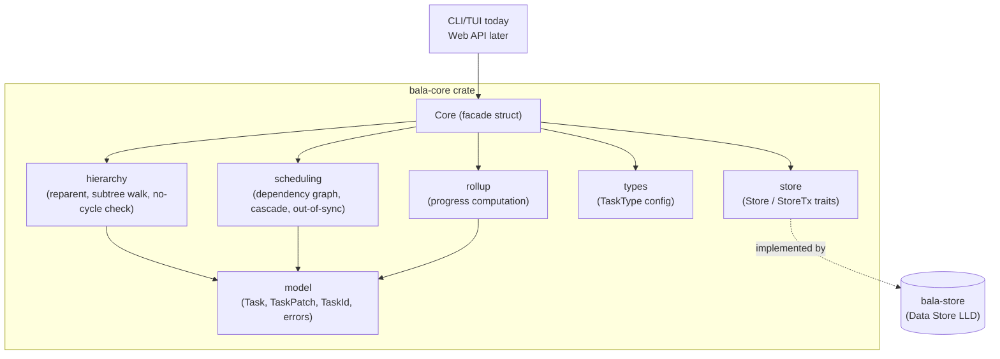

# LLD-1: Bala — Core Library Low-Level Design

**Status:** Proposed
**Date:** 2026-08-31
**Deciders:** Scott (product/eng)
**Related:** [HLD.md](./HLD.md) (Core Library component), [user stories](https://github.com/sleb/bala/issues?q=label%3Astory) (this library owns CRUD, hierarchy, and dependency/rollup logic; the TUI and the Gantt chart are rendering concerns handled by their respective clients)

## Context

HLD.md fixed the Core Library as the single home for task CRUD, hierarchy
invariants, dependency invariants, cascade scheduling, and progress rollup,
exposed as one method contract that the CLI/TUI calls in-process today and
a future Web API wraps unchanged. It deliberately left language, exact
signatures, and algorithms to this LLD. Three decisions from that list
were resolved before writing this doc, since they change the method
surface itself rather than just its implementation:

- **Language: Rust.** A compiled, statically-typed library that both an
  in-process CLI/TUI and a future HTTP layer can call gives the strongest
  compile-time guarantee that invariants (no circular hierarchy, no
  circular dependency, dates always library-computed) can't be bypassed
  by a caller — see the [rust-best-practices](../../.claude/skills/rust-best-practices)
  guidance applied throughout §4–§6 below.
- **Delete: soft-delete.** `delete_task` sets a `deletedAt` tombstone
  rather than physically removing rows. Tombstoned tasks are excluded
  from normal queries but stay in the graph for a recovery window, so
  hierarchy/dependency invariants never have to reason about a task that
  half-exists.
- **Completion: block-by-default, cascade-on-request** — the `rm` /
  `rm -r` model. `complete_task` rejects completing a parent with
  incomplete children unless the caller explicitly asks for the
  cascading form, which completes the whole subtree. No silent
  auto-complete and no silent "just ignore the children" — the caller
  always gets one of the two explicit behaviors.

This LLD covers the `bala-core` crate: its module layout, data types,
error taxonomy, method contract, and the three algorithms (hierarchy
invariant enforcement, dependency cycle detection, cascade scheduling)
that carry the real complexity per HLD's consequences section.

## Decision

`bala-core` is a single crate with internal module seams matching HLD's
call-out (`hierarchy`, `scheduling`, `rollup` are modules, not crates),
plus a `store` module holding the persistence trait boundary and a
`model` module holding shared types. A `Core` struct is the facade every
caller (CLI today, Web API later) drives.



`Core` is generic over its store — `Core<S: Store>` — rather than boxing
internally: there is exactly one store implementation live at a time (the
embedded engine the Data Store LLD picks), so static dispatch costs
nothing and keeps every call monomorphized. A caller that genuinely needs
a trait object (unlikely — the CLI and the future Web API each construct
one concrete `Core<SqliteStore>` at startup) can still box `Core` itself;
that's a boundary decision, not something `bala-core` should pay for
internally.

## Data Model

```rust
/// Opaque, non-`Copy`-sized but small newtype wrapper — one per domain
/// entity — so a `TaskId` can never be passed where a `UserId` is
/// expected, even though both wrap a `Uuid`.
pub struct TaskId(Uuid);
pub struct UserId(Uuid);

/// Minimal user identity for task assignment — no auth, email, roles, or
/// avatars (out of scope per #9); just enough to give
/// `assignee_id` a real entity to resolve to instead of a bare id.
pub struct User {
    pub id: UserId,
    pub name: String,
}

pub struct Task {
    pub id: TaskId,
    pub title: String,
    pub description: Option<String>,
    pub parent_id: Option<TaskId>,  // a task sits under at most one parent;
                                     // None = top-level
    pub type_key: String,           // FK into TaskType.key; "task" default
    pub status: TaskStatus,
    pub start_date: Option<NaiveDate>,
    pub due_date: Option<NaiveDate>,
    pub assignee_id: Option<UserId>,
    pub depends_on: Vec<Dependency>, // predecessors, each typed
    pub out_of_sync: bool,
    pub progress: f32,              // 0.0..=1.0, library-computed, read-only
    pub created_at: DateTime<Utc>,
    pub updated_at: DateTime<Utc>,
    pub completed_at: Option<DateTime<Utc>>,
    pub deleted_at: Option<DateTime<Utc>>,  // soft-delete tombstone
}

pub enum TaskStatus { Incomplete, Complete }

pub struct Dependency {
    pub predecessor_id: TaskId,
    pub dep_type: DependencyType,
}

/// One edge per (predecessor, successor) pair — adding a new type between
/// an already-linked pair replaces the existing edge rather than adding a
/// second one, so `remove_dependency` never has to disambiguate by type.
pub enum DependencyType {
    FinishToStart,  // default; predecessor finishes before successor starts
    StartToStart,   // predecessor starts before successor starts
    FinishToFinish, // predecessor finishes before successor finishes
    StartToFinish,  // predecessor starts before successor finishes
}

pub struct TaskType {
    pub key: String,       // stable identifier, e.g. "initiative"
    pub label: String,     // display name, user-renameable
    pub color: Option<String>,
    pub sort_order: i32,
}

/// Filter predicate for `get_tree`/`list_tasks`. All fields are ANDed;
/// `None`/empty means "don't filter on this". Fixes the assumption
/// Data Store LLD made ahead of this definition (its §Open Questions) —
/// field-for-field, matching the indexes it already built for these:
/// `type_key`, `status`, `assignee_id` each get a partial index on
/// `deleted_at IS NULL`, and `include_deleted` toggles that predicate.
/// `assignee_id` filters against a real `User.id` (#9) — `Core`
/// validates it exists via `Store::get_user` at `create_task` time, so a
/// filter value here always corresponds to a real, resolvable user.
pub struct TreeFilter {
    pub type_key: Option<String>,
    pub status: Option<TaskStatus>,
    pub assignee_id: Option<UserId>,
    pub include_deleted: bool,  // default false: soft-deleted tasks excluded
}

impl Default for TreeFilter {
    fn default() -> Self {
        Self { type_key: None, status: None, assignee_id: None, include_deleted: false }
    }
}
```

**`TaskPatch` — the "don't touch" vs. "clear" problem.** A plain
`Option<T>` field on a patch struct is ambiguous: does `None` mean "leave
it alone" or "set it to nothing"? Rather than lean on `Option<Option<T>>`
(compiles, but reads badly at every call site — `Some(None)` is not
self-documenting), `TaskPatch` uses a small explicit enum per nullable
field:

```rust
pub enum Field<T> {
    Keep,
    Set(T),
    Clear,   // only meaningful for Option<T> targets, e.g. description
}

pub struct TaskPatch {
    pub title: Field<String>,
    pub description: Field<String>,   // Clear -> None
    pub start_date: Field<NaiveDate>, // Clear -> None
    pub due_date: Field<NaiveDate>,   // Clear -> None
    pub assignee_id: Field<UserId>,   // Clear -> unassign
    pub type_key: Field<String>,
    // parent_id and depends_on are intentionally NOT here — reparenting
    // and dependency edits go through their own dedicated methods
    // (set_parent, add/remove_dependency) because each carries its
    // own invariant check that a generic patch would obscure.
}

impl Default for TaskPatch {
    fn default() -> Self { /* every field Field::Keep */ }
}
```

Callers build a patch with struct-update syntax against
`TaskPatch::default()`, touching only what changed — e.g.
`TaskPatch { title: Field::Set("New title".into()), ..Default::default() }`.

## Error Taxonomy

One `thiserror`-derived enum, `CoreError`, per the "structured errors any
caller can render consistently" contract in HLD §Interfaces. No
`anyhow`/string errors cross this boundary — `bala-core` is a library, not
a binary.

```rust
#[derive(Debug, thiserror::Error)]
pub enum CoreError {
    #[error("task {0:?} not found")]
    NotFound(TaskId),

    #[error("title must not be empty")]
    EmptyTitle,

    #[error("due date {due} is before start date {start}")]
    InvalidDateRange { start: NaiveDate, due: NaiveDate },

    #[error("moving {task:?} under {attempted_parent:?} would make it its own ancestor")]
    CircularHierarchy { task: TaskId, attempted_parent: TaskId },

    #[error("a task cannot depend on itself: {0:?}")]
    SelfDependency(TaskId),

    #[error("{task:?} cannot depend on {other:?}: it is an ancestor/descendant of it")]
    DependsOnRelative { task: TaskId, other: TaskId },

    #[error("adding this dependency would create a cycle: {cycle:?}")]
    CircularDependency { cycle: Vec<TaskId> },

    #[error("{task:?} has incomplete children: {incomplete:?}; pass cascade=true or complete them first")]
    IncompleteChildren { task: TaskId, incomplete: Vec<TaskId> },

    #[error("unknown task type {0:?}")]
    UnknownTaskType(String),

    #[error("user name must not be empty")]
    EmptyUserName,

    #[error("unknown user {0:?}")]
    UnknownUser(UserId),

    #[error(transparent)]
    Store(#[from] StoreError),
}
```

Every variant carries the ids/values needed to render a specific message
without re-querying — matching HLD's "touched tasks" philosophy applied
to errors, not just successes.

## Method Contract (the `Core` facade)

```rust
impl<S: Store> Core<S> {
    pub fn create_user(&mut self, name: String) -> Result<User, CoreError>;
    pub fn list_users(&self) -> Result<Vec<User>, CoreError>;
    pub fn create_task(&mut self, new: NewTask) -> Result<Task, CoreError>;
    pub fn update_task(&mut self, id: TaskId, patch: TaskPatch) -> Result<Vec<Task>, CoreError>;
    pub fn delete_task(&mut self, id: TaskId, mode: DeleteMode) -> Result<DeleteOutcome, CoreError>;
    pub fn restore_task(&mut self, id: TaskId) -> Result<Task, CoreError>;
    pub fn set_parent(&mut self, id: TaskId, parent: Option<TaskId>) -> Result<Task, CoreError>;
    pub fn move_sibling(&mut self, id: TaskId, direction: Direction) -> Result<bool, CoreError>;
    pub fn indent_task(&mut self, id: TaskId) -> Result<bool, CoreError>;
    pub fn outdent_task(&mut self, id: TaskId) -> Result<bool, CoreError>;
    pub fn add_dependency(&mut self, id: TaskId, predecessor: TaskId, dep_type: DependencyType) -> Result<Task, CoreError>;
    pub fn remove_dependency(&mut self, id: TaskId, predecessor: TaskId) -> Result<Task, CoreError>;
    pub fn complete_task(&mut self, id: TaskId, cascade: bool) -> Result<Vec<Task>, CoreError>;
    pub fn reopen_task(&mut self, id: TaskId) -> Result<Task, CoreError>;
    pub fn preview_cascade(&self, id: TaskId, patch: TaskPatch) -> Result<Vec<Task>, CoreError>;
    pub fn get_tree(&self, filter: TreeFilter) -> Result<Vec<Task>, CoreError>;
    pub fn get_task(&self, id: TaskId) -> Result<Option<Task>, CoreError>;
    pub fn list_children(&self, id: TaskId) -> Result<Vec<Task>, CoreError>;
    /// Sibling order of every live task, keyed by parent (`None` = top level);
    /// one transaction. `list_children` and `get_tree` follow it: children in
    /// stored position order (creation order by default), `get_tree` results
    /// in depth-first sibling order (unreached tasks sort last).
    pub fn sibling_order(&self) -> Result<SiblingOrder, CoreError>;
    pub fn list_task_types(&self) -> Result<Vec<TaskType>, CoreError>;
    pub fn upsert_task_type(&mut self, t: TaskType) -> Result<TaskType, CoreError>;
}

pub enum DeleteMode { Subtree, PromoteChildren }

pub struct DeleteOutcome {
    pub deleted: Vec<Task>, // tombstoned by this call
    pub updated: Vec<Task>, // survived, but its own fields changed
}
```

`DeleteMode` and `complete_task`'s `cascade: bool` are the two places this
contract encodes the "rm vs. rm -r" decision from §Context — deliberately
as an explicit parameter rather than two method names, since the CLI/Web
API each map it onto one confirmation prompt either way.

Every task has at most one parent, so the tasks beneath A form a subtree
that belongs to A alone. `DeleteMode::Subtree` soft-deletes (tombstones)
A and every descendant of A, at any depth, with no survivors: nothing
beneath A is reachable any other way, so nothing is kept. The walk is an
iterative work-stack (no recursion, since hierarchy depth is unbounded)
that reaches each descendant once; a descendant already tombstoned by an
earlier call is left as it was, keeping its original `deleted_at`, and is
not reported again. `DeleteMode::PromoteChildren` tombstones only A: each
of A's children is moved to A's own parent (or to the top level, if A
had none), landing after that parent's existing children in the order
they had under A, and keeps its own children. Either mode runs in one
store transaction.

`delete_task` reports what it changed as a `DeleteOutcome` rather than
one mixed list, so no caller has to partition on `deleted_at` itself:
`deleted` holds every task the call tombstoned, `updated` every task that
survived but whose own fields changed — the children a `PromoteChildren`
delete reparented. A `Subtree` delete leaves no survivor whose own row
changes, so its `updated` is always empty. Both lists hold only tasks
whose own stored row changed, each at most once and at its final value,
and no id is in both. A parent whose rolled-up `progress` changed only
because its children changed (e.g. A's parent, once A is gone) is in
neither list; a caller showing it re-fetches it.

`move_sibling(id, Direction::{Up,Down})` reorders `id` by one place among
its parent's children (the top level for a task with no parent) in a
single transaction. The parent is read from the task, never supplied by
the caller. It swaps with the nearest *live* sibling in that direction
(tombstoned siblings are skipped) via `StoreTx::swap_child_positions`, so
only the order of the parent's children changes: `id`'s parent, depth and
`updated_at` are untouched. It returns `true` if the task
moved and `false` at the end of the list (a true no-op: no write, no error).
It fails with `NotFound` for a missing/deleted `id`.

`indent_task(id)` / `outdent_task(id)` likewise read the task's place in
the tree from the store (its parent, plus that parent's parent for
outdent) inside their transaction. Each runs in one transaction and
writes the new parent through `hierarchy::set_parent`, so the cycle guard
is shared with `set_parent` (`CircularHierarchy`, which neither move can
trigger in a valid tree). Both return `true` on a change and `false` on a
no-op (no write, no `updated_at` bump); a change bumps `updated_at` and
refreshes `parent_id`. Both fail with `NotFound` for a missing/deleted
`id`.

- Indent: the target is the nearest *live* previous sibling under `id`'s
  parent (tombstoned ones skipped); `id` becomes its last child. No
  previous sibling: no-op. Only `id`'s own edge changes, so its subtree
  follows.
- Outdent: `id` joins its parent's parent's children immediately after
  its old parent (`Placement::After(old_parent)`); when the old parent is
  top level, so is `id` afterwards. A task with no parent (already top
  level) is a no-op.

`set_parent(id, parent)` moves `id` under `parent`; `None` promotes it to
the top level. The whole read-check-write is one transaction: `id` and
`parent` must both name live tasks (`NotFound` otherwise, `id` checked
first), and the hierarchy invariant (§1) is checked before the edge is
written, so a rejected call (`CircularHierarchy`) changes nothing. The
task lands after the new parent's existing children and its subtree moves
with it. Setting the parent a task already has is a true no-op: no write,
`updated_at` is unchanged and the task keeps its position among its
siblings.

## Algorithms

### 1. Hierarchy invariant — no circular nesting ([#37](https://github.com/sleb/bala/issues/37) AC5)

The hierarchy is a tree: a task has at most one parent, so its ancestors
are one chain. `set_parent(id, parent)` follows that chain upward from
`parent` — `parent` itself, then `get_parent_edge` of each task reached —
until it runs out at the top level. If `id` turns up, the move would make
`id` its own ancestor: reject with `CircularHierarchy { task: id,
attempted_parent: parent }`, before anything is written. The walk is a
plain loop: it needs no visited set (one chain has no second path to a
task) and no recursion (depth is unbounded, so recursing could overflow
the stack). O(depth) per call.

`hierarchy::set_parent` is the writer for an *existing* task's parent
edge whenever the task is put under a parent, and every such write goes
through it and its check. It skips the walk when the move cannot create a
cycle: to the top level, or to the parent the task already has. The one
write that bypasses it is a `Subtree` delete, which moves each
descendant's edge straight to the top level as it tombstones it — a move
that cannot create a cycle either.

`create_task` skips the check and writes the new task's edge directly: a
freshly minted id has no descendants, so it cannot be an ancestor of
`NewTask.parent_id`, and the parent's existence is validated in the same
transaction that writes the task and its edge. Running the walk anyway
would cost one `get_parent_edge` per ancestor, making every create under
a deep chain O(depth) for a check that can never fail.

### 2. Dependency invariants ([#60](https://github.com/sleb/bala/issues/60) AC2–3)

`add_dependency(id, predecessor, dep_type)`:
1. Reject with `SelfDependency(id)` if `id == predecessor`.
2. Reject with `DependsOnRelative` if `predecessor` is an ancestor or a
   descendant of `id` in the hierarchy graph — this is the one place a
   dependency check must cross into the hierarchy graph, per HLD §4.
   Both directions are checked by walking *upward* along one parent
   chain (§1's loop): from `id` looking for `predecessor` (an ancestor),
   then from `predecessor` looking for `id` (a descendant). A descendant
   of `id` is exactly a task from which `id` is reachable upward, so
   there is no need to scan `id`'s whole subtree; each walk visits only
   the ancestors of where it starts.
3. Cycle check on the dependency graph itself: before adding the edge
   `predecessor → id`, walk from `predecessor` following existing
   `depends_on` edges (i.e., walk what `predecessor` already
   (transitively) depends on). If `id` is reachable, `predecessor`
   already depends on `id`, so making `id` depend on `predecessor` would
   close a cycle — reject with `CircularDependency { cycle }`. The walk
   must start at `predecessor`, not `id`: what `id` already depends on
   says nothing about the new edge, so walking from `id` would accept
   A→B→A (B depends on A, then A on B) and reject a redundant edge that
   closes no cycle (C depends on B depends on A, then C on A).
   `cycle` is the path `[id, predecessor, …, id]`, each entry depending
   on the next: it starts with the new edge and follows existing edges
   back to `id`. The walk records, for each task, the task it was first
   discovered from, and rebuilds the path from those steps. It is an
   iterative work-stack with a `visited` set (no recursion, since
   dependency chains are unbounded; a task reachable by several paths is
   walked once), so this is a plain reachability check, not a full
   topological sort, and runs in O(edges) per call. The check doesn't
   depend on `dep_type` — a cycle is a cycle regardless of which of the
   four types closes it — and, as soft-deleted tasks keep their
   dependency edges, it walks through them.
4. If an edge already exists between `predecessor` and `id` (of any
   type), it is replaced by the new one rather than adding a second edge
   — see §Data Model, `Dependency` — so `add_dependency` is also how a
   caller changes an existing edge's type. Re-adding an edge with the
   type it already has is a true no-op: no write, and `updated_at` is
   unchanged.

`remove_dependency` has no invariant to check — removing an edge can
never introduce a cycle or a relative-dependency violation. Only the
dependent task (`id`) must be live; the predecessor may be soft-deleted.
Removing an edge that doesn't exist is a true no-op: no write, and
`updated_at` is unchanged.

### 3. Cascade scheduling ([#61](https://github.com/sleb/bala/issues/61) AC1–4)

Each `DependencyType` anchors a different field of the predecessor to a
different field of the successor:

| Type | Constraint | Anchor field (predecessor) | Constrained field (successor) |
|---|---|---|---|
| Finish-to-Start (FS, default) | `successor.start ≥ predecessor.due` | `due_date` | `start_date` |
| Start-to-Start (SS) | `successor.start ≥ predecessor.start` | `start_date` | `start_date` |
| Finish-to-Finish (FF) | `successor.due ≥ predecessor.due` | `due_date` | `due_date` |
| Start-to-Finish (SF) | `successor.due ≥ predecessor.start` | `start_date` | `due_date` |

`constraint_ok(edge, pred, succ)` and `anchor_date(edge, pred)` are the
two small per-type functions everything below is built from — the rest
of the algorithm is type-agnostic once those exist.

Two distinct triggers, kept separate because they have different
observable outcomes:

- **A task's own dates are edited directly** (`update_task` on a task
  that itself has predecessors): for each predecessor edge, if
  `constraint_ok` is now violated, the edit is **allowed but flags
  `out_of_sync = true`** on that task (AC4 — manual override, not an
  auto-correction). A task with multiple predecessor edges (possibly of
  different types) is out-of-sync if *any* edge is violated.
- **A predecessor's `start_date` or `due_date` changes, forward
  propagation to successors** (AC1–2): for every outgoing edge whose
  constraint is now violated, the successor's *constrained field* shifts
  forward by the same delta (duration preserved — the other field moves
  with it), and that shift is *not* flagged out-of-sync — it's the
  system doing its job, not an override. Because FS/SS constrain the
  successor's `start_date` while FF/SF constrain its `due_date`, a
  single predecessor change is checked against all outgoing edges
  regardless of type — an SS edge can fire off a `start_date` change the
  same way an FS edge fires off a `due_date` change.

Cascade algorithm (used by both `update_task`'s forward-propagation step
and `preview_cascade`):

```
fn cascade(changed: TaskId, graph) -> Vec<Task> {
    let mut touched = HashMap::new();       // TaskId -> Task, dedup + latest value
    let mut queue = VecDeque::from([changed]);
    while let Some(current) = queue.pop_front() {
        let current_task = touched.get(&current).unwrap_or_else(|| graph.task(current));
        for (successor, edge) in graph.successor_edges_of(current) {  // (task, DependencyType)
            let succ_task = touched.get(&successor.id).unwrap_or(&successor);
            if !constraint_ok(edge, current_task, succ_task) {
                let anchor = anchor_date(edge, current_task);
                let delta = anchor - constrained_field(edge, succ_task);
                let shifted = succ_task.shift_by(delta);  // preserves duration; shifts both start and due
                touched.insert(successor.id, shifted);
                queue.push_back(successor.id);            // re-examine its own successors
            }
        }
    }
    touched.into_values().collect()
}
```

Because the dependency graph is acyclic by construction (§2 rejects
cycles at edge-add time, independent of edge type), this queue drains in
finite steps — a task can be re-pushed if a later relaxation shifts it
further out (multiple incoming edges), but each push strictly increases
its constrained field, so the loop terminates. `preview_cascade` runs
this against an in-memory copy of the affected subgraph and returns the
result **without** calling `Store::put_task` — same computation, no
commit, satisfying [#61](https://github.com/sleb/bala/issues/61) AC3's "preview before committing".

`update_task` calls `cascade` whenever `start_date` or `due_date` moves,
then persists `[changed_task] + touched` inside one `Store::transaction`,
and returns the full `Vec<Task>` so a caller can refresh every affected
view without re-querying (HLD §Interfaces guarantee).

### 4. Progress rollup ([#39](https://github.com/sleb/bala/issues/39) AC1–5)

Computed on read inside `get_tree`, never stored, never computed by a
caller (HLD guarantee). A task's `progress` is derived from its **direct**
children's own `status` flag only — never from a child's own (separately
computed) `progress`, and never by looking past direct children to
grandchildren:

```
fn direct_children_progress(children, own_status) -> f32 {
    if children.is_empty() {
        return match own_status { Complete => 1.0, Incomplete => 0.0 };  // AC5
    }
    children.iter()
        .map(|c| match c.status { Complete => 1.0, Incomplete => 0.0 })
        .sum::<f32>() / children.len() as f32
}
```

This is the corrected formula: averaging children's own `progress`
(rather than their `status`) would leak grandchildren's completion two
levels up, contradicting AC2. For example, a task with two direct
children, each itself `Complete` but each carrying ten incomplete
grandchildren of its own, rolls up to `1.0` (2 of 2 direct children
complete) — the grandchildren never factor in, because only the direct
children's own `status` is consulted, not their `progress`.

A task's own `status` is independent of its rollup number once it has
children (AC4) — `progress` and `status` are reported as two separate
fields on `Task`, never conflated. Because the formula only ever reads
each direct child's `status` (not its `progress`), there is no recursion
and nothing to memoize: computing one task's `progress` is a single flat
lookup of its direct children's `status`, independent of traversal order
or of any other task's rollup. `get_tree` computes this once per result
task, each a `list_child_edges` + `get_task`-per-child lookup — O(n + e)
for the whole tree per call (n result tasks, e parent-child edges walked
across all of them), not O(n) per task. Every task has at most one
parent edge, so e is at most n and the whole tree is O(n).

"Children" is the reverse lookup — every task whose `parent_id` is this
task's id, read through `list_child_edges`. Each task is a child of at
most one parent, so its `status` counts toward exactly one rollup, its
parent's; there is nothing to split, normalize, or memoize.

### 5. `complete_task` ([#13](https://github.com/sleb/bala/issues/13) AC2, resolved per §Context)

```
fn complete_task(id, cascade) -> Result<Vec<Task>, CoreError> {
    let incomplete = incomplete_descendants(id);  // every depth, not just direct children
    if !incomplete.is_empty() && !cascade {
        return Err(CoreError::IncompleteChildren { task: id, incomplete });
    }
    // cascade == true: complete the whole subtree; cascade == false with
    // no incomplete descendants: complete just this task.
    mark_complete(id, recursive: cascade)
}
```

`incomplete_descendants` walks the whole subtree, not just direct
children, so `IncompleteChildren.incomplete` always names exactly the set
`cascade: true` would go on to complete — a caller rendering a
confirmation prompt from this error (e.g. the TUI's cascade-confirm,
[#26](https://github.com/sleb/bala/issues/26) AC3) gets an accurate count without re-walking the hierarchy
itself.

Returns every task actually completed (one, or the whole touched
subtree) — again so a caller refreshes views from the return value
rather than re-querying.

`reopen_task` is the reverse transition, Complete → Incomplete, added
when the TUI's completion toggle needed a way back.

## Storage Boundary

Not a network contract (HLD §4) — a Rust trait so `bala-core` is
testable against an in-memory fake today and the Data Store LLD's
embedded engine is just another implementation. Per HLD, hierarchy
(`parent_id`) and dependency edges are related-but-independent graphs
stored distinctly, so the trait doesn't fold edges into the task row.
A task has one parent edge, which carries its position among its
siblings (a top-level task's edge has no parent), so the hierarchy is
read and written through edge methods of its own:

```rust
pub trait Store {
    fn transaction<T>(
        &self,
        f: impl FnOnce(&mut dyn StoreTx) -> Result<T, StoreError>,
    ) -> Result<T, StoreError>;
}

pub trait StoreTx {
    fn get_user(&mut self, id: UserId) -> Result<Option<User>, StoreError>;
    fn put_user(&mut self, user: &User) -> Result<(), StoreError>;
    fn list_users(&mut self) -> Result<Vec<User>, StoreError>;

    fn get_task(&mut self, id: TaskId) -> Result<Option<Task>, StoreError>;
    fn put_task(&mut self, task: &Task) -> Result<(), StoreError>;
    fn list_tasks(&mut self, filter: &TreeFilter) -> Result<Vec<Task>, StoreError>;

    /// `id`'s parent; `None` = top level (or no such task).
    fn get_parent_edge(&mut self, id: TaskId) -> Result<Option<TaskId>, StoreError>;
    /// `None` = the top-level tasks (children of the NULL parent), in position order.
    fn list_child_edges(&mut self, parent: Option<TaskId>) -> Result<Vec<TaskId>, StoreError>;
    /// Every (parent, child) edge grouped by parent, position order within each
    /// (`None` = top level), tombstones included. One call, so whole-hierarchy
    /// reads (`Core::sibling_order`) avoid a `list_child_edges` per parent.
    fn list_all_child_edges(&mut self) -> Result<Vec<(Option<TaskId>, TaskId)>, StoreError>;
    /// Puts `child` under `parent` (`None` = top level), replacing the one edge
    /// it had. Already under `parent`: nothing changes, position kept. Otherwise
    /// the old edge is removed and `child` joins `parent`'s children per
    /// `placement`: `Placement::End` appends; `Placement::After(sibling)` inserts
    /// right after `sibling`, falling back to `End` if `parent`'s children do not
    /// contain `sibling` (or if `sibling == child`).
    fn set_parent_edge(&mut self, child: TaskId, parent: Option<TaskId>, placement: Placement) -> Result<(), StoreError>;
    /// Swaps the positions of `a` and `b` among `parent`'s children; no-op if
    /// either is not a child of `parent`.
    fn swap_child_positions(&mut self, parent: Option<TaskId>, a: TaskId, b: TaskId) -> Result<(), StoreError>;

    fn list_dependency_edges(&mut self, id: TaskId) -> Result<Vec<Dependency>, StoreError>;
    fn list_successor_edges(&mut self, id: TaskId) -> Result<Vec<TaskId>, StoreError>;
    fn add_dependency_edge(&mut self, predecessor: TaskId, successor: TaskId, dep_type: DependencyType) -> Result<(), StoreError>;
    fn remove_dependency_edge(&mut self, predecessor: TaskId, successor: TaskId) -> Result<(), StoreError>;

    fn get_task_types(&mut self) -> Result<Vec<TaskType>, StoreError>;
    fn put_task_type(&mut self, t: &TaskType) -> Result<(), StoreError>;
}
```

`list_child_edges`/`list_successor_edges` are the reverse of
`get_parent_edge`/`list_dependency_edges` — resolving Data Store LLD's
§Open Questions item 1 as named trait methods rather than something
`Core` reconstructs in memory from a bulk `list_tasks`. §Algorithm 3's
cascade (`graph.successor_edges_of(current)`) calls `list_successor_edges`
per task walked, and §Algorithm 4's rollup ("children" = reverse lookup
of `parent_id`) calls `list_child_edges` per task in its post-order
traversal — both were already relying on this direction existing, just
without a named method to call.

Every `Core` method that touches more than one task (cascade, subtree
delete/complete) wraps its writes in one `Store::transaction` call, so a
cascade either commits as a whole or not at all — the Data Store LLD's
job is to make `transaction` atomic for whatever engine it picks, not to
redesign this boundary.

**Not addressed here (matches HLD's open item):** multiple concurrent
writers. `Core` assumes single-writer-at-a-time, consistent with a local
embedded store; multi-client concurrent editing is still an open question
flagged at the HLD level, not solved by adding locking here.

## Testing Strategy

- `hierarchy`, `scheduling`, and `rollup` are unit-tested against an
  in-memory fake `Store` — no I/O, fast, and exercises exactly the
  algorithms in §Algorithms.
- Name tests for behavior, not method name, per rust-best-practices:
  e.g. `add_dependency_should_reject_cycle_through_transitive_predecessor`,
  `complete_task_should_block_when_children_incomplete_and_cascade_false`,
  `set_parent_should_reject_missing_parent`,
  `delete_task_subtree_should_tombstone_every_descendant`.
- Cascade tests per `DependencyType`: one predecessor/successor pair for
  each of FS/SS/FF/SF confirming the right field pair (start↔start,
  due↔start, due↔due, start↔due) is checked and shifted; plus a mixed
  case where the same predecessor has both an FS and an SS successor to
  confirm each is evaluated by its own edge's rule independently.
- Property-style tests for cascade: random small DAGs (with a random mix
  of dependency types), assert the post-cascade graph satisfies each
  edge's own type-specific constraint and that `preview_cascade` and
  `update_task` agree on the touched set before the latter commits.
- Delete over a tree: a `Subtree` delete of a branching, several-level
  subtree tombstones every descendant, leaves the tasks around it
  untouched and reports an empty `updated`; a `PromoteChildren` delete
  moves the children to the deleted task's parent (or to the top level
  if it had none), keeping their order. A chain thousands of levels deep
  is deleted and cascade-completed without overflowing the stack.
- Rollup: each parent's `progress` reflects only its own direct
  children's `status`; since this is a flat per-parent lookup rather
  than a graph traversal, there's no memoization concern to test.

## Deferred to Other LLDs

- **Data Store LLD:** which embedded engine implements `Store`/`StoreTx`,
  schema, indexing for tree + dependency queries at 200+ tasks. (Its own
  two open questions back to this LLD — reverse-edge trait methods and
  `TreeFilter`'s fields — are now resolved above: `list_child_edges`/
  `list_successor_edges` and §Data Model's `TreeFilter`.)
- **CLI/TUI Client LLD:** how `preview_cascade`'s result is rendered as a
  confirmation prompt ([#61](https://github.com/sleb/bala/issues/61) AC3) and how `IncompleteChildren`/
  `CircularHierarchy`/etc. map to on-screen messages.
- **Web API LLD:** near-mechanical mapping of this method contract onto
  routes; `CoreError` variants map onto HTTP status + JSON error body.

## Consequences

- The three method-shape decisions from §Context (soft-delete,
  block-then-cascade completion, `Field<T>` patches) are now load-bearing
  on the public API — changing any later is a breaking change to every
  caller, including the future Web API.
- `Core<S: Store>` being generic rather than trait-object-based means one
  monomorphized build per concrete store; fine today (one store type),
  worth revisiting only if a second concrete `Store` impl (e.g. a test
  double shipped in the same binary as production) ever needs to coexist
  at runtime rather than at compile time.
- `preview_cascade` and the committing path in `update_task` share the
  same `cascade()` function by construction — there's no way for preview
  to drift from what actually commits, which is the whole point of
  [#61](https://github.com/sleb/bala/issues/61) AC3.
- The hierarchy is a tree (HLD §Product Assumptions): `parent_id` is an
  `Option<TaskId>` across the model, the facade and the store trait, so
  §1's invariant check and §2's ancestor/descendant walk are loops up one
  chain rather than graph searches. Work two goals share is a dependency
  between them, not a second parent, so a task counts toward the rolled-up
  progress of its one parent only. Allowing a second parent later would
  be a breaking change to every caller, including the future Web API.
- Typed dependencies are similarly load-bearing on §3's cascade algorithm:
  starting with FS-only usage in practice doesn't defer any of this
  complexity, since the constraint/anchor abstraction had to exist from
  the start to keep FS a special case of the general rule rather than a
  hardcoded path SS/FF/SF would later have to be retrofitted around.

## Action Items
1. [ ] Scaffold `bala-core` crate with the module layout in §Decision
2. [ ] Implement `model`, `CoreError`, `Field<T>`/`TaskPatch` (no logic yet)
3. [ ] Implement `hierarchy` module + tests (§Algorithm 1)
4. [ ] Implement `scheduling` module + tests (§Algorithms 2–3), including `preview_cascade`
5. [ ] Implement `rollup` module + tests (§Algorithm 4)
6. [ ] Implement `complete_task` + `delete_task`/`restore_task` (§Algorithm 5, soft-delete)
7. [ ] Define in-memory fake `Store` for tests; hand the `Store`/`StoreTx` traits to the Data Store LLD
