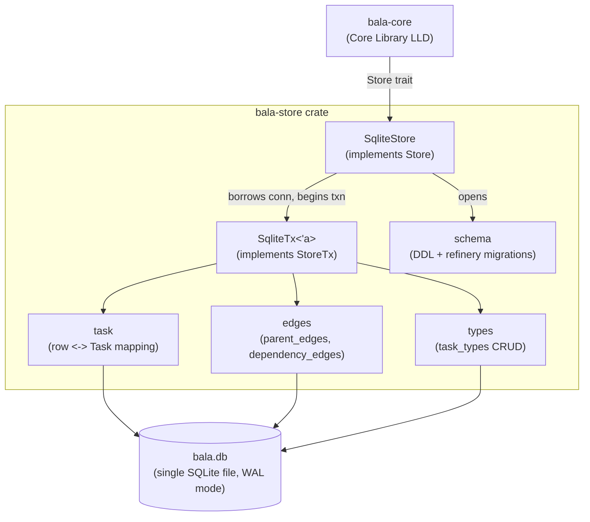

# LLD-2: Bala — Data Store Low-Level Design

**Status:** Proposed
**Date:** 2026-09-03
**Deciders:** Scott (product/eng)
**Related:** [HLD.md](./HLD.md) (Data Store component), [LLD-core-library.md](./core-library.md) (`Store`/`StoreTx` trait boundary this LLD implements)

## Context

HLD.md fixed the Data Store as durable persistence for tasks, hierarchy
edges, dependency edges, and task types, with schema/indexing/engine choice
deferred here. LLD-core-library.md has since gone further and fixed the
actual boundary this component must satisfy: a synchronous `Store`/`StoreTx`
Rust trait pair (not a network contract), with hierarchy and dependency
edges stored as distinct edge sets rather than folded into the task row,
and every multi-task write (cascade, subtree delete/complete) wrapped in
one `Store::transaction` call that must commit atomically or not at all.

Three decisions are resolved here rather than left open, since — like
Core LLD's three — they shape the schema and index design, not just its
implementation:

- **Engine: SQLite via `rusqlite`.** The trait boundary already commits to
  a relational edge-table shape (`list_parent_edges`, `add_dependency_edge`,
  etc., not "mutate an array embedded in a task document"), and that shape
  needs indexed reverse lookups (children-of, successors-of) and
  multi-row atomic transactions — both of which a relational engine gives
  for free via `CREATE INDEX` and `BEGIN`/`COMMIT`, and which an embedded
  document/KV store (sled, redb) would require hand-rolling as secondary
  index trees. `rusqlite` over `sqlx`/`diesel`: `Store` is a synchronous
  trait (matching the CLI's synchronous, single-process, single-writer
  world per Core LLD §Storage Boundary), so an async client buys nothing
  but runtime weight; and the schema is four tables with hand-writable
  queries, not enough surface to justify an ORM's codegen ceremony.
- **IDs: `BLOB(16)`, raw UUID bytes.** Compact, indexable, and — despite
  being opaque as raw bytes — still inspectable ad hoc via the `sqlite3`
  CLI using `hex(id)` in `SELECT` and `X'...'`/`unhex()` in `WHERE`, so
  the debuggability TEXT would have bought isn't actually given up.
- **Migrations: embedded `.sql` files + a Rust runner (`refinery`),
  applied automatically when the store is opened.** Versioned and
  checked into the repo from the start, even though there's only one
  schema version today — the alternative (bootstrap now, add migrations
  later) means retrofitting a framework onto a schema that already has
  shipped local data, which is exactly the situation migrations exist to
  avoid.

This LLD covers the `bala-store` crate: schema, indexes, the
`Store`/`StoreTx` implementation, transaction semantics, and the one real
open question it surfaces back to Core LLD (§Open Questions).

## Decision

`bala-store` is a single crate exposing one public type, `SqliteStore`,
implementing Core LLD's `Store` trait. Internally it mirrors the trait's
four concerns as modules: `schema` (DDL + migrations), `task` (task-row
read/write), `edges` (parent + dependency edge queries), `types`
(`TaskType` CRUD).



`SqliteStore` holds a single `rusqlite::Connection` wrapped in a
`RefCell` — not a `Mutex` — because `Store::transaction` takes `&self`
(per Core LLD) while `rusqlite::Connection::transaction()` needs `&mut
Connection`. `RefCell` gets `&self` → `&mut Connection` without changing
Core LLD's already-committed trait signature. This is safe _and_
sufficient specifically because Core LLD's storage boundary already
assumes single-writer-at-a-time (no concurrent `Store` callers) — a
`RefCell` panics on reentrant borrow rather than blocking, so a caller
that ever _did_ nest one `Store::transaction` inside another would panic
immediately in dev/test rather than deadlock or silently interleave.
`SqliteStore` is therefore `!Sync`; if a future multi-threaded caller
needs one, that caller wraps it in a `Mutex<SqliteStore>` at its own
boundary rather than this crate paying for thread-safety no current
caller needs.

## Schema

Four tables, matching the four concerns in Core LLD's `StoreTx` trait
one-for-one. Dates are stored as ISO-8601 `TEXT` (`NaiveDate` →
`YYYY-MM-DD`, `DateTime<Utc>` → RFC 3339) rather than integer epoch —
sortable as plain strings, and readable directly in `sqlite3` without a
conversion function, which matters for a local single-user app someone
may reasonably inspect by hand.

```sql
-- schema/V1__init.sql

CREATE TABLE task_types (
    key         TEXT PRIMARY KEY,
    label       TEXT NOT NULL,
    color       TEXT,
    sort_order  INTEGER NOT NULL
);

CREATE TABLE users (
    id    BLOB PRIMARY KEY,   -- 16-byte UUID
    name  TEXT NOT NULL
);

CREATE TABLE tasks (
    id            BLOB PRIMARY KEY,          -- 16-byte UUID
    title         TEXT NOT NULL,
    description   TEXT,
    type_key      TEXT NOT NULL REFERENCES task_types(key),
    status        TEXT NOT NULL CHECK (status IN ('incomplete', 'complete')),
    start_date    TEXT,                      -- ISO-8601 date
    due_date      TEXT,
    assignee_id   BLOB,
    out_of_sync   INTEGER NOT NULL DEFAULT 0, -- 0/1
    created_at    TEXT NOT NULL,              -- RFC 3339 UTC
    updated_at    TEXT NOT NULL,
    completed_at  TEXT,
    deleted_at    TEXT                        -- soft-delete tombstone; NULL = live
);
-- progress is library-computed on read (Core LLD §Algorithm 4) — no column.

CREATE INDEX idx_tasks_type_live     ON tasks(type_key)     WHERE deleted_at IS NULL;
CREATE INDEX idx_tasks_status_live   ON tasks(status)       WHERE deleted_at IS NULL;
CREATE INDEX idx_tasks_assignee_live ON tasks(assignee_id)  WHERE deleted_at IS NULL;

CREATE TABLE parent_edges (
    parent_id BLOB NOT NULL REFERENCES tasks(id),
    child_id  BLOB NOT NULL REFERENCES tasks(id),
    PRIMARY KEY (parent_id, child_id)
);
-- PK's leading column (parent_id) already indexes "children of X"
-- (rollup, subtree delete). Reverse direction needs its own index:
CREATE INDEX idx_parent_edges_child ON parent_edges(child_id); -- "parents of X"
                                                                -- (hierarchy upward walk, §1)

CREATE TABLE dependency_edges (
    predecessor_id BLOB NOT NULL REFERENCES tasks(id),
    successor_id   BLOB NOT NULL REFERENCES tasks(id),
    dep_type       TEXT NOT NULL CHECK (
        dep_type IN ('finish_to_start', 'start_to_start', 'finish_to_finish', 'start_to_finish')
    ),
    PRIMARY KEY (predecessor_id, successor_id)  -- one edge per pair (Core LLD §Data Model);
                                                 -- add_dependency_edge upserts, doesn't duplicate
);
-- PK's leading column (predecessor_id) indexes "what depends on X"
-- (cascade forward-propagation, §3; list_successor_edges). Reverse needs
-- its own index:
CREATE INDEX idx_dependency_edges_successor ON dependency_edges(successor_id); -- "what does X depend on"
                                                                                -- (dependency validity walk, §2;
                                                                                -- list_dependency_edges)
```

`PRAGMA foreign_keys = ON` and `PRAGMA journal_mode = WAL` are set on
every connection open — `WAL` for better read/write interleaving even
though writes are already single-threaded (readers, e.g. a future `get_tree`
call mid-transaction from the same process, don't block on it), and
`foreign_keys` as a free, always-on defense-in-depth check that no edge
or task row can reference a nonexistent id — invariants Core LLD already
enforces in Rust before writing, but a DB-level constraint catches a
`bala-store` bug (not a `bala-core` caller bug) that skips the trait.

**`migrations/V2__add_users.sql` (Story 1.1a).** SQLite can't
`ALTER TABLE ... ADD COLUMN ... REFERENCES ...` — a `REFERENCES` clause
can only be declared when a column is first created, and `tasks.assignee_id`
already exists (untyped `BLOB`, no FK) from V1. Giving it the FK the
Core LLD's user-validation invariant now depends on means the standard
SQLite "add a constraint to an existing column" rebuild: create the new
`users` table; rename `tasks` out of the way; create a new `tasks` table
identical to V1's except `assignee_id BLOB REFERENCES users(id)`; copy
every row across with a plain `INSERT INTO tasks SELECT ... FROM
tasks_old`; drop `tasks_old`; and recreate `idx_tasks_type_live`,
`idx_tasks_status_live`, and `idx_tasks_assignee_live` against the new
table, since `DROP TABLE` takes its indexes with it. No existing row can
violate the new FK (V1 never populated `assignee_id`), so the copy step
needs no data migration beyond the straight copy.

Deletion is soft-delete only (Core LLD §Context, resolved there): `DELETE
FROM tasks` is never issued by this crate outside of the (unused today)
possibility of a future hard-purge job; `delete_task` maps to `UPDATE
tasks SET deleted_at = ?`. Edge rows for a tombstoned task are **not**
cascade-deleted — Core LLD's delete algorithm (§Method Contract) already
computes which specific parent/child edges to drop before the tombstone
ever gets written, so `bala-store` only ever removes the edges `bala-core`
explicitly asks it to via `remove_parent_edge`/`remove_dependency_edge`.

## Error Taxonomy

```rust
#[derive(Debug, thiserror::Error)]
pub enum StoreError {
    #[error("sqlite error: {0}")]
    Sqlite(#[from] rusqlite::Error),

    #[error("migration error: {0}")]
    Migration(#[from] refinery::Error),

    #[error("stored data could not be decoded: {0}")]
    Corrupt(String),  // e.g. a status/dep_type value outside the CHECK constraint's
                       // known set, or a BLOB that isn't 16 bytes — defense against
                       // a DB written by a future/older schema version, not expected
                       // in normal operation
}
```

`StoreError` is what `CoreError::Store(#[from] StoreError)` wraps (Core
LLD §Error Taxonomy) — `bala-store` never returns a bare `rusqlite::Error`
across its own public API undecorated by this enum, so `bala-core` (and
transitively any caller) has one error type to match on regardless of
which layer failed.

## `Store` / `StoreTx` Implementation

```rust
pub struct SqliteStore {
    conn: RefCell<rusqlite::Connection>,
}

impl SqliteStore {
    /// Opens (creating if absent) the SQLite file at `path`, applying any
    /// pending migrations. `path` is caller-supplied — this crate has no
    /// opinion on config-dir conventions; that's the CLI/TUI Client LLD's
    /// concern (see §Open Questions).
    pub fn open(path: &Path) -> Result<Self, StoreError> { /* ... */ }

    /// In-memory (`:memory:`) store for tests — same migrations, no file.
    pub fn open_in_memory() -> Result<Self, StoreError> { /* ... */ }
}

impl Store for SqliteStore {
    fn transaction<T>(
        &self,
        f: impl FnOnce(&mut dyn StoreTx) -> Result<T, StoreError>,
    ) -> Result<T, StoreError> {
        let mut conn = self.conn.borrow_mut();
        let tx = conn.transaction()?;         // rusqlite's own BEGIN/COMMIT-on-drop
        let mut store_tx = SqliteTx { tx };
        let result = f(&mut store_tx)?;       // any Err short-circuits; tx rolls back on drop
        store_tx.tx.commit()?;
        Ok(result)
    }
}

struct SqliteTx<'a> {
    tx: rusqlite::Transaction<'a>,
}

impl<'a> StoreTx for SqliteTx<'a> {
    fn get_user(&mut self, id: UserId) -> Result<Option<User>, StoreError> {
        // SELECT id, name FROM users WHERE id = ?
    }
    fn put_user(&mut self, user: &User) -> Result<(), StoreError> {
        // INSERT INTO users ... ON CONFLICT(id) DO UPDATE
    }
    fn list_users(&mut self) -> Result<Vec<User>, StoreError> {
        // SELECT id, name FROM users
    }

    fn get_task(&mut self, id: TaskId) -> Result<Option<Task>, StoreError> { /* row + edges, see below */ }
    fn put_task(&mut self, task: &Task) -> Result<(), StoreError> { /* INSERT ... ON CONFLICT(id) DO UPDATE */ }
    fn list_tasks(&mut self, filter: &TreeFilter) -> Result<Vec<Task>, StoreError> { /* see §Query Strategy */ }

    fn list_parent_edges(&mut self, id: TaskId) -> Result<Vec<TaskId>, StoreError> {
        // SELECT parent_id FROM parent_edges WHERE child_id = ?  (idx_parent_edges_child)
    }
    fn list_child_edges(&mut self, id: TaskId) -> Result<Vec<TaskId>, StoreError> {
        // SELECT child_id FROM parent_edges WHERE parent_id = ?  (PK's leading column —
        // no extra index needed, same table §Schema already indexes both directions)
    }
    fn add_parent_edge(&mut self, parent: TaskId, child: TaskId) -> Result<(), StoreError> {
        // INSERT OR IGNORE INTO parent_edges ...  (idempotent: re-adding an existing edge is a no-op)
    }
    fn remove_parent_edge(&mut self, parent: TaskId, child: TaskId) -> Result<(), StoreError> {
        // DELETE FROM parent_edges WHERE parent_id = ? AND child_id = ?
    }

    fn list_dependency_edges(&mut self, id: TaskId) -> Result<Vec<Dependency>, StoreError> {
        // SELECT predecessor_id, dep_type FROM dependency_edges WHERE successor_id = ?
        // (predecessors of id, i.e. Task.depends_on — matches Core LLD's Data Model shape)
    }
    fn list_successor_edges(&mut self, id: TaskId) -> Result<Vec<TaskId>, StoreError> {
        // SELECT successor_id FROM dependency_edges WHERE predecessor_id = ?  (PK's leading
        // column — "what depends on id", used by §Algorithm 3's forward-propagation walk)
    }
    fn add_dependency_edge(&mut self, predecessor: TaskId, successor: TaskId, dep_type: DependencyType) -> Result<(), StoreError> {
        // INSERT INTO dependency_edges ... ON CONFLICT(predecessor_id, successor_id) DO UPDATE SET dep_type = excluded.dep_type
        // (upsert — matches "replaces the existing edge" in Core LLD §Data Model / §Algorithm 2 step 4)
    }
    fn remove_dependency_edge(&mut self, predecessor: TaskId, successor: TaskId) -> Result<(), StoreError> { /* DELETE ... */ }

    fn get_task_types(&mut self) -> Result<Vec<TaskType>, StoreError> { /* SELECT * ORDER BY sort_order */ }
    fn put_task_type(&mut self, t: &TaskType) -> Result<(), StoreError> { /* INSERT ... ON CONFLICT(key) DO UPDATE */ }
}
```

`add_parent_edge` and `add_dependency_edge` are both **idempotent
upserts**, not plain inserts: the edge tables' primary keys make a
duplicate `add_parent_edge` on an already-existing edge a silent no-op
(`INSERT OR IGNORE`) rather than a constraint-violation error, and a
repeated `add_dependency_edge` on an existing pair _replaces_ the type
rather than erroring — this is what makes that call double as "change an
existing edge's type" per Core LLD §Algorithm 2 step 4, with no special
"does this edge already exist" branch needed on the `bala-core` side.

## Query Strategy: Avoiding N+1 on `list_tasks`

`Task` carries `parent_ids: Vec<TaskId>` and `depends_on: Vec<Dependency>`
inline (Core LLD §Data Model), but those live in separate tables here.
Naively, assembling `N` tasks would cost `1 + 2N` queries (one for the
task rows, two edge queries per task). Instead, `list_tasks`/`get_tree`'s
path batches:

1. One query against `tasks` (plus `task_types` if the filter needs it)
   to get the matching id set and scalar fields.
2. One query against `parent_edges WHERE child_id IN (...)` for the
   whole id set, grouped by `child_id` in Rust into a `HashMap<TaskId,
Vec<TaskId>>`.
3. One query against `dependency_edges WHERE successor_id IN (...)`,
   same grouping.
4. Zip the three into `Vec<Task>`.

Four queries regardless of `N` (SQLite's `IN (...)` with a few hundred
values is well within normal limits — no chunking needed at the 200+
task scale HLD cites). `get_task(id)` (single task) skips the batching
and just does the 1+2 direct-lookup form, which is simpler and cheap at
N=1.

Core LLD's `TreeFilter` (§Data Model there) has four fields — `type_key`,
`status`, `assignee_id`, `include_deleted` — and the indexes above
(`type_key`, `status`, `assignee_id`, all partial on `deleted_at IS
NULL`) cover exactly those, making the filter predicates Stories 2.4 AC4
("filter/group by type") and 3.3 AC4 ("show only blocked/unblocked")
imply cheap. `include_deleted = true` simply drops the `WHERE deleted_at
IS NULL` predicate, falling back to a full scan on the (unindexed)
`deleted_at` column — acceptable since it's the uncommon path and still
fine at hundreds of rows.

## Testing Strategy

- Every test opens a fresh `SqliteStore::open_in_memory()` (migrations
  applied, no filesystem I/O) — fast enough to run one store per test
  rather than sharing state.
- `StoreTx` methods are tested directly against `SqliteStore`, one test
  module per table group (`task`, `edges`, `types`), named for behavior
  per the repo's existing convention (LLD-core-library.md §Testing
  Strategy): e.g. `add_parent_edge_should_be_idempotent_on_duplicate`,
  `add_dependency_edge_should_replace_type_on_existing_pair`,
  `list_tasks_should_exclude_soft_deleted_by_default`,
  `list_child_edges_should_return_all_children_of_multi_child_parent`,
  `list_successor_edges_should_return_all_successors_of_multi_successor_predecessor`,
  `put_user_and_get_user_round_trip`,
  `list_users_should_return_all_created_users`,
  `put_task_should_persist_and_round_trip_assignee_id`,
  `list_tasks_should_filter_by_assignee_id`,
  `put_task_should_fail_when_assignee_id_references_nonexistent_user`.
- **Transaction atomicity**: a test that runs a `transaction` closure
  which writes several tasks/edges then returns `Err`, asserting nothing
  committed (`get_task` on any of them still returns the pre-transaction
  state) — this is the one property Core LLD's cascade/subtree-delete
  guarantees depend on entirely at this layer.
- **Multi-parent / multi-edge correctness**: a task with two parents
  round-trips both parent ids through `put_task`'s edge-independent
  design (edges added via `add_parent_edge`, not embedded in the row) —
  confirms `list_tasks` batching (§Query Strategy) groups correctly when
  a child has >1 parent edge row.
- **Foreign-key/constraint smoke test**: writing an edge or dependency
  referencing a nonexistent task id fails fast via the `PRAGMA
foreign_keys` constraint, confirming it's actually enabled per
  connection (a common `rusqlite` footgun — the pragma must be set on
  every new connection, it isn't a database-file-level setting).
- A perf smoke test seeding 200+ tasks with a realistic edge density and
  asserting `list_tasks`/`get_tree`'s query count stays at the fixed
  small number in §Query Strategy regardless of `N` (not a query-plan
  assertion — a call-count assertion, matching the pattern
  LLD-core-library.md uses for its own memoization tests).

## Resolved Since First Draft

Two things this LLD had made an assumption about because Core LLD's
`StoreTx` trait didn't fully pin them down at the time — both raised
back to Core LLD in review and now fixed there:

1. **Reverse-edge lookups.** `StoreTx` now has named methods for both
   directions: `list_parent_edges`/`list_dependency_edges` (parents of
   `id` / predecessors of `id`, as this LLD already assumed) alongside
   new `list_child_edges`/`list_successor_edges` (children of `id` /
   successors of `id`) for §Algorithm 3's cascade and §Algorithm 4's
   rollup. No schema change was needed — the reverse direction was
   already indexed (`idx_parent_edges_child` and the `parent_edges` PK;
   `idx_dependency_edges_successor` and the `dependency_edges` PK, see
   §Schema); this only added the two trait methods and their
   implementations above (§`Store`/`StoreTx` Implementation).
2. **`TreeFilter`'s fields.** Now defined in Core LLD (§Data Model):
   `type_key: Option<String>`, `status: Option<TaskStatus>`,
   `assignee_id: Option<UserId>`, `include_deleted: bool` — exactly what
   §Query Strategy assumed and already indexed for.

## Deferred to Other LLDs

- **CLI/TUI Client LLD:** where the SQLite file lives on disk (config/
  data dir convention, e.g. XDG on Linux) — `SqliteStore::open` takes a
  path and has no opinion on it.
- Nothing here is deferred _from_ HLD that isn't now resolved: engine,
  schema, and indexing (HLD's three explicit action items for this LLD)
  are all fixed above.

## Consequences

- `SqliteStore` is `!Sync` by construction (`RefCell`, not `Mutex`) —
  correct today under Core LLD's single-writer assumption, but any
  future multi-threaded caller (unlikely before a server-side Web API
  exists, and even then that API is still one `Core<SqliteStore>` per
  process per HLD) must wrap it in its own `Mutex`, not expect thread
  safety from this crate.
- Soft-delete means the tasks table only grows — no `DELETE FROM tasks`
  path exists yet. Fine at the "single-user/small-team, hundreds of
  tasks" scale HLD targets; a hard-purge job (e.g. "empty trash after 30
  days") is a future addition, not a redesign, since it's just a new
  `DELETE ... WHERE deleted_at < ?` query against the existing schema.
- Choosing `rusqlite` over `sqlx` means no compile-time query checking —
  a typo'd column name is a runtime `StoreError`, caught by the test
  suite in §Testing Strategy rather than at `cargo build` time. Accepted
  given the schema is small, stable, and fully owned by this one crate.
- Batch-fetching edges (§Query Strategy) instead of the straightforward
  per-task query is the one piece of real complexity in an otherwise
  mechanical CRUD layer — worth it specifically because Core LLD's
  `get_tree` is called on every view refresh (HLD's "touched tasks"
  philosophy means callers re-fetch trees often), so N+1 there would be
  the actual bottleneck at 200+ tasks, not anything algorithmic in
  `bala-core`.

## Action Items

1. [ ] Scaffold `bala-store` crate; wire `refinery` migration runner
2. [ ] Write `V1__init.sql` per §Schema; `SqliteStore::open`/`open_in_memory`
3. [ ] Implement `task` module (`get_task`, `put_task`, batched `list_tasks` per §Query Strategy)
4. [ ] Implement `edges` module (`parent_edges`, `dependency_edges`, both directions —
       `list_parent_edges`/`list_child_edges`, `list_dependency_edges`/`list_successor_edges` —
       idempotent add, plain remove)
5. [ ] Implement `types` module (`task_types` CRUD)
6. [ ] Implement `Store::transaction` (`RefCell`-based, §Decision) and wire `SqliteTx`
7. [ ] Write tests per §Testing Strategy, including the transaction-rollback and foreign-key smoke tests
